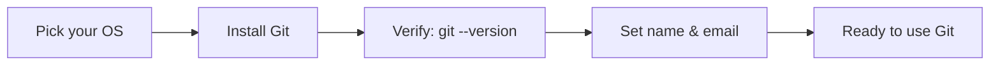

# Module 00 — Installation

## What You Will Learn

- What Git is and why nearly every software project uses it.
- How to install Git on **Windows** (installer, winget, Scoop, Chocolatey).
- How to install Git on **Linux** (apt, dnf, yum, pacman, zypper).
- How to verify the install and set your identity for the first time.

## Why This Module Matters

You can't track a single change until Git is on your machine. This module gets you from "nothing installed" to "ready to commit" in a few commands, on whichever OS you use.

## Real-World Use Case

A new laptop, a fresh CI runner, or a teammate onboarding — every one of these starts with installing Git and setting a name/email so commits are attributable.

## Topics Covered

| File | What It Covers |
|------|----------------|
| [installation.md](./installation.md) | Install methods for Windows & Linux, verification, first-time identity setup |

## Learning Flow

## Hands-On Practice

Install Git, run `git --version`, then set your `user.name` and `user.email`. Open a terminal and confirm `git` is on your PATH.

## Common Mistakes

- Forgetting to restart the terminal after a Windows install (the `git` command won't be found).
- Skipping identity setup — commits then show a blank or machine-default author.

## Troubleshooting

- `git: command not found` → reopen the terminal, or check that Git's `bin` folder is on PATH.
- Old version? Update via your package manager or reinstall from the official site.

## Best Practices

- Prefer the official installer / your distro's package manager over random binaries.
- Set `user.name` and `user.email` immediately after installing.

## Quick Revision

- Git is the industry-standard version control system.
- Install it per-OS, verify with `git --version`, then set your identity.

## Next Module

➡️ [01 — Configuration](../01-configuration/): identity, editor, credentials, and aliases.

<!-- NAV-FOOTER -->

---

### 🧭 Navigation

| Previous | Up | Next |
|:---|:---:|---:|
| ⬅️ Prev: [Git Cheat Sheet](../README.md) | ⬆️ Home: [Git Cheat Sheet](../README.md) | ➡️ Next: [Installation](installation.md) |
