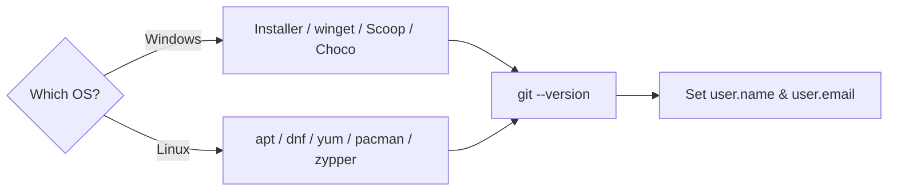

# Installation

## 1. What Is This?

Installing Git — putting the version-control program on your machine so the `git` command works in your terminal. This covers Windows and the major Linux distributions.

## 2. Why Is This Needed?

Git is the industry-standard version control system. It tracks every change to your code, lets you experiment safely on branches, collaborate with teams without overwriting each other's work, and roll back to any previous state at any time. Nearly every software project — from personal scripts to large open-source projects — uses Git.

Without Git (or any VCS), the only options are manual backups, careful file naming, and hoping nothing breaks. With Git, every mistake is recoverable and every decision is documented.

## 3. Simple Layman Explanation

Installing Git is like installing the "save game" engine for your code. Until it's installed, your project has no save points. Once it's on, every snapshot you take is recoverable.

## 4. Technical Explanation

Git is distributed as native packages for every platform. On **Windows** you use an installer or a package manager (winget/Scoop/Chocolatey); on **Linux** you use the distro's package manager, which pulls Git and its dependencies from the official repositories and puts the `git` binary on your PATH.

## 5. Real-World Example

You join a team and get a fresh laptop. Before you can clone the company repo, you install Git, verify the version, and set your name/email so your first commit is correctly attributed to you in `git blame` and `git log`.

## 6. Diagram



## 7. Commands

```bash
# --- Windows (PowerShell) ---
winget install --id Git.Git -e --source winget   # winget
scoop install git                                 # Scoop
choco install git                                 # Chocolatey
# Or download the installer from https://git-scm.com/download/win

# --- Linux ---
sudo apt update && sudo apt install git -y        # Debian / Ubuntu
sudo dnf install git -y                            # Fedora
sudo yum install git -y                            # RHEL / CentOS 7
sudo pacman -S git                                 # Arch / Manjaro
sudo zypper install git                            # openSUSE

# --- Verify ---
git --version
# git version 2.x.x

# --- First steps after install: set your identity ---
git config --global user.name "Your Name"
git config --global user.email "you@example.com"
```

## 8. Command Explanation

- The **Windows installer** from the official site includes Git Bash, Git GUI, and shell integration — the easiest option for most Windows users.
- `winget` / `scoop` / `choco` install Git from a package source so it's easy to update later.
- The Linux commands invoke each distro's package manager to fetch Git from the official repos.
- `git --version` confirms the binary is installed and on PATH.
- `git config --global user.name/user.email` stamps your identity on every commit you make.

## 9. Practice Tasks

1. Install Git using the method that fits your OS.
2. Run `git --version` and confirm it prints a version number.
3. Set your `user.name` and `user.email`, then verify with `git config user.name`.

## 10. Common Mistakes

- Not restarting the terminal after a Windows install, so `git` isn't found yet.
- Forgetting to set identity — commits show no author or the OS default.
- Installing an outdated Git from a third-party site instead of the official source.

## 11. Troubleshooting

- `git: command not found` → reopen the terminal (Windows) or confirm Git's `bin` directory is on PATH.
- Package manager can't find `git` → run `sudo apt update` (or the distro equivalent) first.
- Need a newer version than your distro ships? Add the official PPA/repo or use the static binary.

## 12. Best Practices

- Use the official installer or your distro's package manager — avoid random binaries.
- Set `user.name` and `user.email` right after installing.
- On Windows, prefer Git Bash for a Unix-like shell experience.

## 13. Quick Recap

- Git installs per-OS via installer or package manager.
- Verify with `git --version`.
- Always set your identity before your first commit.

## 14. References

- [Git — Downloads (all platforms)](https://git-scm.com/downloads)
- [Pro Git — Installing Git](https://git-scm.com/book/en/v2/Getting-Started-Installing-Git)
- [GitHub Docs — Set up Git](https://docs.github.com/en/get-started/getting-started-with-git/set-up-git)

<!-- NAV-FOOTER -->

---

### 🧭 Navigation

| Previous | Up | Next |
|:---|:---:|---:|
| ⬅️ Prev: [Module 00 — Installation](README.md) | ⬆️ Module: [Module 00 — Installation](README.md) | ➡️ Next: [Module 01 — Configuration](../01-configuration/README.md) |
