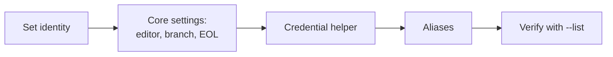

# Module 01 — Configuration

## What You Will Learn

- How Git's three config scopes (**system → global → local**) override each other.
- How to set your identity, default branch, editor, and line-ending behavior.
- How to store credentials so you don't retype passwords on every push.
- How to define **aliases** that compress everyday commands into muscle memory.

## Why This Module Matters

Out of the box, Git doesn't know who you are or how you like to work. Config turns a generic install into *your* environment — correct author on every commit, the right editor, and shortcuts for the commands you run dozens of times a day.

## Real-World Use Case

You use a personal email for side projects but a work email for the company repo. Scoped config lets you set a global default and override it locally in the work repo — no mixed-up authorship.

## Topics Covered

| File | What It Covers |
|------|----------------|
| [configuration.md](./configuration.md) | Scopes, identity, core settings, credentials, viewing config, aliases |

## Learning Flow

## Hands-On Practice

Set your name and email globally, pick an editor, then add the `lg` and `st` aliases. Run `git config --list --show-origin` to see every active setting and where it comes from.

## Common Mistakes

- Setting config `--local` when you meant `--global` (or vice-versa).
- Choosing an editor you can't exit (Vim) without knowing how.

## Troubleshooting

- Wrong author on commits? Check `git config user.email` — a local value may be overriding global.
- Stuck in an editor on commit? That's `core.editor`; set it to something you know.

## Best Practices

- Keep personal defaults global; override per-repo only when needed.
- Use `--global --edit` to review your whole config in one place.

## Quick Revision

- Config layers: local overrides global overrides system.
- Identity, editor, and credentials are the must-set basics.
- Aliases save keystrokes on commands you repeat constantly.

## Next Module

➡️ [02 — Git Basics](../02-basics/): init, clone, status, stage, commit.

<!-- NAV-FOOTER -->

---

### 🧭 Navigation

| Previous | Up | Next |
|:---|:---:|---:|
| ⬅️ Prev: [Installation](../00-installation/installation.md) | ⬆️ Home: [Git Cheat Sheet](../README.md) | ➡️ Next: [Configuration](configuration.md) |
