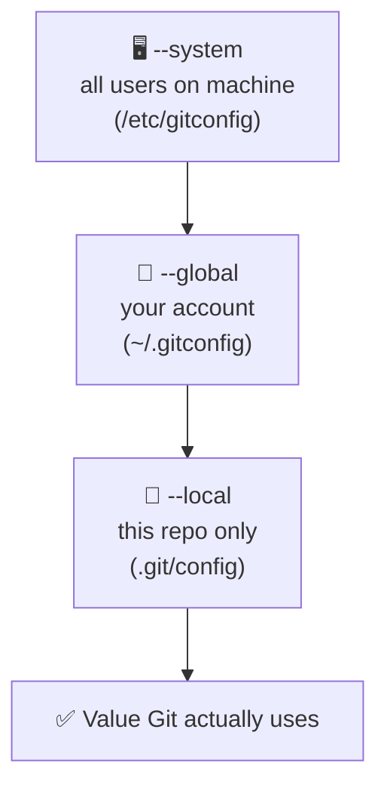
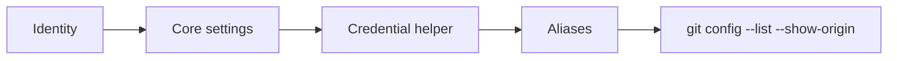

# Configuration

## 1. What Is This?

Git configuration is the set of values — your identity, preferred editor, line-ending rules, credential storage, and command aliases — that control how Git behaves on your machine and in each repo.

## 2. Why Is This Needed?

Out of the box, Git doesn't know who you are. Every commit records an author name and email — if you skip this step, your contributions are attributed to nothing or to whatever the OS default is, making `git blame` and `git log --author` useless for finding your own work.

Beyond identity, configuration controls behavior that directly affects your workflow:
- The **default editor** determines what opens when you write a commit message or resolve a rebase — pick one you're comfortable in, or you'll be stuck in Vim with no way out.
- **Line ending handling** prevents Windows CRLF endings from showing up as changes in every file when collaborating cross-platform.
- **Aliases** compress commands you run dozens of times per day (`git lg`, `git sw`) into muscle memory.
- **Credential storage** means you authenticate once instead of on every push.

## 3. Simple Layman Explanation

Config is the "settings menu" for Git. You fill in your name once, choose your tools, and create shortcuts — then Git remembers it all so you don't repeat yourself.

## 4. Technical Explanation

Git reads config in three layers and later layers override earlier ones:



The most specific scope wins: **local overrides global overrides system.** That's how you set a personal email globally but use a work email in a single work repo.

## 5. Real-World Example

```bash
git config --global user.email "me@gmail.com"        # default everywhere
cd ~/work/project
git config --local user.email "me@company.com"       # just this repo
```

Now personal projects are authored with your personal email and work commits with your work email — automatically, based on which repo you're in.

## 6. Diagram



## 7. Commands

```bash
# --- Identity ---
git config --global user.name "Your Name"
git config --global user.email "you@example.com"

# --- Core settings ---
git config --global init.defaultBranch main         # default branch name
git config --global core.editor "code --wait"       # VS Code (or "vim" / "nano")
git config --global color.ui auto                    # colorize output
git config --global core.autocrlf true               # Windows line endings
git config --global core.autocrlf input              # macOS / Linux line endings

# --- Credential storage (authenticate once) ---
git config --global credential.helper store          # Linux — plaintext ~/.git-credentials
git config --global credential.helper osxkeychain    # macOS — Keychain
git config --global credential.helper manager        # Windows — Git Credential Manager

# --- Viewing config ---
git config --list --show-origin                      # all settings + where they come from
git config user.name                                 # a single value
git config --global --edit                           # open global config in your editor

# --- Useful aliases ---
git config --global alias.st status
git config --global alias.co checkout
git config --global alias.sw switch
git config --global alias.br branch
git config --global alias.lg "log --oneline --graph --decorate --all"
git config --global alias.undo "reset HEAD~1 --mixed"
git config --global alias.unstage "restore --staged"
git config --global alias.last "log -1 HEAD --stat"
git config --global alias.aliases "config --get-regexp alias"
```

## 8. Command Explanation

- `--global` writes to `~/.gitconfig`; `--local` (the default inside a repo) writes to `.git/config`.
- `init.defaultBranch main` names the first branch `main` instead of `master`.
- `core.editor` sets what opens for commit messages and interactive rebase.
- `core.autocrlf` normalizes line endings so cross-platform diffs stay clean.
- `credential.helper` caches/stores your credentials so pushes don't prompt every time.
- Aliases map a short name to a longer command: `git lg` runs the full pretty graph log.

## 9. Practice Tasks

1. Set your global `user.name` and `user.email`.
2. Add the `lg` alias and run `git lg` in any repo.
3. Run `git config --list --show-origin` and find which file each value lives in.

## 10. Common Mistakes

- Using `--local` outside a repo (it errors) or when you meant `--global`.
- Setting an editor like Vim without knowing how to save and quit (`:wq`).
- Forgetting that a local `user.email` silently overrides the global one.

## 11. Troubleshooting

- Commits show the wrong author → check for a `--local` override with `git config --show-origin user.email`.
- Every file shows as modified on Windows → it's likely CRLF; set `core.autocrlf` correctly.
- Stuck in the commit editor → set `core.editor` to `nano` or `code --wait`.

## 12. Best Practices

- Keep personal defaults global; override per-repo only when necessary.
- Use annotated, memorable aliases — but don't alias away commands you're still learning.
- Review your whole config periodically with `--global --edit`.

## 13. Quick Recap

- Config scopes: local → global → system (most specific wins).
- Set identity, editor, line endings, and a credential helper first.
- Aliases turn frequent commands into short, fast ones.

## 14. References

- [Pro Git — First-Time Git Setup](https://git-scm.com/book/en/v2/Getting-Started-First-Time-Git-Setup)
- [Pro Git — Git Configuration](https://git-scm.com/book/en/v2/Customizing-Git-Git-Configuration)
- [git config — official docs](https://git-scm.com/docs/git-config)
- [GitHub Docs — Set up Git](https://docs.github.com/en/get-started/getting-started-with-git/set-up-git)

<!-- NAV-FOOTER -->

---

### 🧭 Navigation

| Previous | Up | Next |
|:---|:---:|---:|
| ⬅️ Prev: [Module 01 — Configuration](README.md) | ⬆️ Module: [Module 01 — Configuration](README.md) | ➡️ Next: [Module 02 — Git Basics](../02-basics/README.md) |
