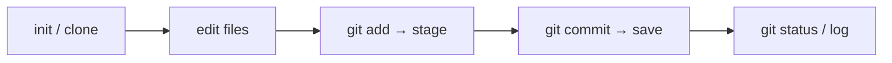

# Module 02 — Git Basics

## What You Will Learn

- The **three areas** of Git: Working Directory, Staging Area, Repository.
- How to create and clone repositories.
- How to check status, stage changes, and commit.
- What a commit *really* is (a snapshot, a hash, and a parent link) and what HEAD means.

## Why This Module Matters

This is the mental model everything else builds on. Once you "see" the three areas, every later command — branch, merge, reset, stash — clicks into place instead of feeling like magic.

## Real-World Use Case

You fixed a bug in `login.js` and started experimenting in `dashboard.js`. Staging lets you commit *only* the bug fix as a clean, reviewable commit and leave the half-finished work for later.

## Topics Covered

| File | What It Covers |
|------|----------------|
| [basics.md](./basics.md) | init/clone, status, staging, committing, commit conventions, what a commit is |

## Learning Flow

## Hands-On Practice

Run `git init` in an empty folder, create a `README.md`, `git add` it, commit it, then run `git log --oneline` to see your snapshot in history.

## Common Mistakes

- Thinking `git add` saves your work — it only *stages*; `git commit` saves.
- Amending a commit that's already been pushed to a shared branch.

## Troubleshooting

- "nothing to commit" but you edited files? They may be untracked — check `git status`.
- Committed too early? `git commit --amend` fixes the last (unpushed) commit.

## Best Practices

- Commit small, logical units — one concern per commit.
- Write [Conventional Commit](https://www.conventionalcommits.org/) messages (`feat:`, `fix:`, …).

## Quick Revision

- Files move Working Dir → Staging (`add`) → Repo (`commit`).
- A commit is a snapshot + a unique hash + a parent link.
- HEAD points to the commit you're currently on.

## Next Module

➡️ [03 — Branching & Merging](../03-branching-and-merging/): isolate work, then integrate it.

<!-- NAV-FOOTER -->

---

### 🧭 Navigation

| Previous | Up | Next |
|:---|:---:|---:|
| ⬅️ Prev: [Configuration](../01-configuration/configuration.md) | ⬆️ Home: [Git Cheat Sheet](../README.md) | ➡️ Next: [Git Basics](basics.md) |
