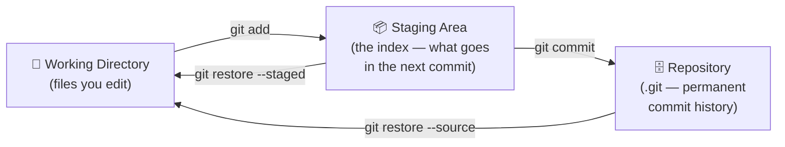
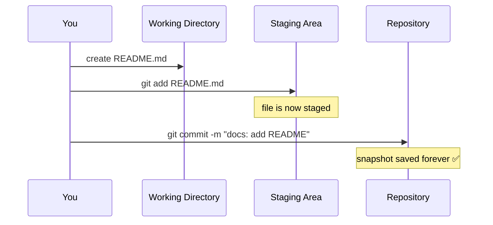
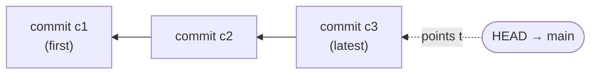

# Git Basics

## 1. What Is This?

The core, everyday Git workflow: creating or cloning a repository, checking what changed, staging the changes you want, and committing them as a permanent snapshot.

## 2. Why Is This Needed?

Every software project changes over time. Without version control, you're left with manual backups (`auth_v2_final_FINAL.js`), no way to trace who changed what or why, and no safe way to experiment. Git solves this by recording every change as a **commit** — a permanent, addressable snapshot of your project at a point in time.

Key reasons Git is the standard:
- **History** — every change is recorded, attributable, and reversible.
- **Collaboration** — multiple developers can work on the same codebase without overwriting each other.
- **Branching** — experiment or develop features in complete isolation, then merge when ready.
- **Distributed** — every developer has a full copy of the repo; there's no single point of failure.

## 3. Simple Layman Explanation

Think of Git like the *save points* in a video game. Every commit is a save point you can return to. If you mess up, you reload the last good save instead of restarting the whole game.

Staging is like an **online shopping cart**: you browse the whole store (working directory), add only the items you actually want to the cart (`git add`), then check out (`git commit`). You don't have to buy everything just because you looked at it.

## 4. Technical Explanation

Almost everything in Git is about moving files between **three areas**:



- **Working Directory** — the actual files on disk you're editing.
- **Staging Area** (the index) — a loading dock where you place exactly the changes for your next commit.
- **Repository** — the permanent, recorded history once you commit.

The staging area is what lets you bundle only related changes into one commit, review exactly what's about to be committed, and split a messy session into clean, logical commits.

## 5. Real-World Example

You create a `README.md`, stage it, and commit "docs: add README". `git status` then reports "nothing to commit, working tree clean" — your snapshot is saved forever.



## 6. Diagram

A commit is **not** a diff — it's a full **snapshot** with a unique hash and a link to its parent. That parent link is what chains commits into history.



**HEAD** is "where you are right now" — a pointer to the commit you currently have checked out. When you commit, HEAD moves forward to the new commit. Because each hash is derived from content *and* parent, you can't secretly alter an old commit — that's what makes Git history tamper-evident.

## 7. Commands

```bash
# --- Repository setup ---
git init                                            # new repo in current dir
git init my-project                                 # new repo in a new dir
git clone https://github.com/user/repo.git          # clone a remote repo
git clone --depth 1 https://github.com/user/repo.git  # shallow clone (faster for CI)
git clone --branch develop https://github.com/user/repo.git  # clone a specific branch

# --- Checking status ---
git status                                          # full status
git status -s                                       # compact: M=modified ??=untracked A=added

# --- Staging ---
git add file.txt                                    # stage one file
git add src/                                        # stage a directory
git add .                                           # stage everything here
git add -p                                          # patch mode: choose hunks interactively
git restore --staged file.txt                       # unstage (keep edits)

# --- Committing ---
git commit -m "feat: add login page"                # commit staged changes
git commit -am "fix: correct null check"            # stage tracked files + commit
git commit                                          # open editor for a multi-line message
git commit --amend -m "fix: corrected message"      # fix the last commit's message
git add forgotten.txt && git commit --amend --no-edit  # add a file to the last commit
git commit --allow-empty -m "chore: trigger CI"     # empty commit (re-trigger pipelines)

# --- Inspect the latest commit / HEAD ---
git log --oneline -3                                # recent commits, short form
git rev-parse HEAD                                  # full hash of current commit
git branch --show-current                           # branch HEAD is on
```

## 8. Command Explanation

- `git init` creates the `.git` database; `git clone` copies an existing remote repo.
- `git status` shows what's staged, unstaged, and untracked; `-s` is the compact view.
- `git add` moves changes into the staging area; `-p` lets you stage individual hunks.
- `git commit -m` records staged changes as a snapshot; `-a` auto-stages *tracked* files.
- `--amend` rewrites the most recent commit — only safe before pushing to a shared branch.

## 9. Practice Tasks

1. `git init` a folder, create a file, stage it, and commit it.
2. Make two unrelated edits, then use `git add -p` to stage only one.
3. Amend your last commit to fix its message with `git commit --amend`.

## 10. Common Mistakes

- Believing `git add` saves your work — it only stages; `commit` saves.
- Running `git commit -am` and expecting it to include *new* (untracked) files — it doesn't.
- Amending a commit that's already pushed to a shared branch (rewrites shared history).

## 11. Troubleshooting

- "nothing to commit, working tree clean" but you changed files → they're likely untracked; `git add` them.
- Committed the wrong message → `git commit --amend -m "..."` (if unpushed).
- Forgot a file in the last commit → `git add file && git commit --amend --no-edit`.

## 12. Best Practices

- One concern per commit — keep them small and reviewable.
- Use [Conventional Commits](https://www.conventionalcommits.org/): `<type>: <summary>` (`feat`, `fix`, `chore`, `docs`, `refactor`, `test`).
- Review `git status` / `git diff --staged` before committing.

## 13. Quick Recap

- Files flow Working Dir → Staging (`add`) → Repo (`commit`).
- A commit = snapshot + unique hash + parent link.
- HEAD points to your current commit and moves forward when you commit.

## 14. References

- [Pro Git — Recording Changes to the Repository](https://git-scm.com/book/en/v2/Git-Basics-Recording-Changes-to-the-Repository)
- [Pro Git — Git Internals: Git Objects](https://git-scm.com/book/en/v2/Git-Internals-Git-Objects)
- [git add](https://git-scm.com/docs/git-add) · [git commit](https://git-scm.com/docs/git-commit)
- [Conventional Commits specification](https://www.conventionalcommits.org/en/v1.0.0/)

<!-- NAV-FOOTER -->

---

### 🧭 Navigation

| Previous | Up | Next |
|:---|:---:|---:|
| ⬅️ Prev: [Module 02 — Git Basics](README.md) | ⬆️ Module: [Module 02 — Git Basics](README.md) | ➡️ Next: [Module 03 — Branching & Merging](../03-branching-and-merging/README.md) |
