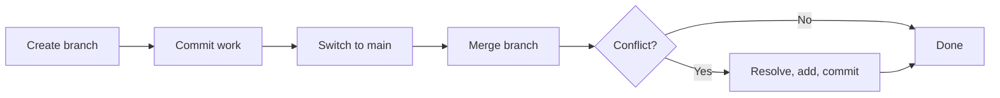

# Module 03 — Branching & Merging

## What You Will Learn

- What a branch really is (a lightweight, movable pointer to a commit).
- How to create, switch, rename, and delete branches.
- How to merge branches, and the difference between **fast-forward** and **`--no-ff`**.
- How to resolve merge conflicts calmly and correctly.

## Why This Module Matters

`main` should always be deployable. Branches let each feature or fix develop in isolation so broken or half-finished work never breaks the shared codebase. Merging is how that finished work comes back together.

## Real-World Use Case

Three teammates build three features at once, each on its own branch. They open Pull Requests, get reviewed, and merge independently — `main` stays stable the whole time.

## Topics Covered

| File | What It Covers |
|------|----------------|
| [branching-and-merging.md](./branching-and-merging.md) | Branch model, create/switch/delete, merge, fast-forward vs no-ff, conflict resolution |

## Learning Flow

## Hands-On Practice

Create `feature/test`, commit a change, switch back to `main`, and merge it. Then deliberately create a conflict by editing the same line on both branches and resolve it.

## Common Mistakes

- Merging *from* the wrong branch — always merge *into* the branch you want to update.
- Leaving conflict markers (`<<<<<<<`) in the file after "resolving".

## Troubleshooting

- Lost in a conflict? `git status` lists unresolved files; `git merge --abort` backs out entirely.
- Can't delete a branch? Use `-D` to force-delete an unmerged branch (you lose its commits).

## Best Practices

- Use short-lived, descriptively named branches (`feature/login`, `fix/null-check`).
- Many teams use `--no-ff` so each feature is one clear bubble in history.

## Quick Revision

- A branch is just a ~40-byte pointer to a commit.
- Fast-forward = linear; `--no-ff` = preserves the branch as a merge commit.
- Conflicts mean both sides changed the same lines — you decide the result.

## Next Module

➡️ [04 — Rebasing](../04-rebasing/): replay commits for a clean, linear history.

<!-- NAV-FOOTER -->

---

### 🧭 Navigation

| Previous | Up | Next |
|:---|:---:|---:|
| ⬅️ Prev: [Git Basics](../02-basics/basics.md) | ⬆️ Home: [Git Cheat Sheet](../README.md) | ➡️ Next: [Branching & Merging](branching-and-merging.md) |
