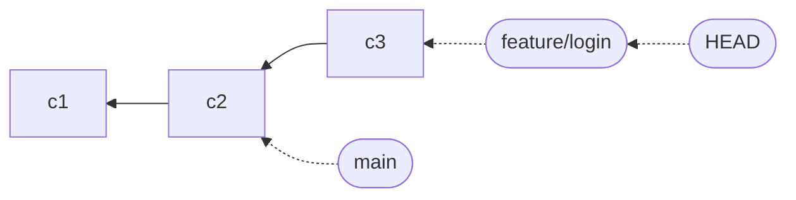
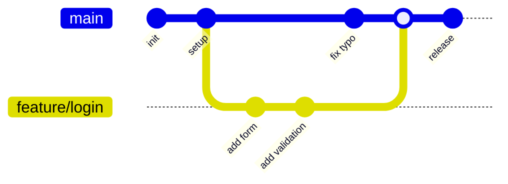
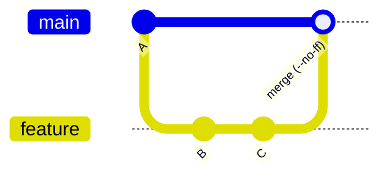

# Branching & Merging

## 1. What Is This?

A **branch** is a separate line of development. **Merging** brings the commits from one branch into another. Together they let you work in isolation and then integrate.

## 2. Why Is This Needed?

In a shared codebase, `main` should always be in a working, deployable state. If everyone committed directly to `main`, any in-progress feature or broken experiment would immediately break the project for the whole team.

Branches give each feature/fix a separate line of development, enabling:
- **Parallel development** — multiple features in flight without conflict.
- **Safe experimentation** — try an approach; if it fails, delete the branch and nothing is lost.
- **Code review** — open a Pull Request from a branch, get feedback, then merge.
- **Release management** — maintain stable `release/x.x` branches while `main` moves forward.

Merging then creates a point in history where two lines come together — explicit evidence that a feature was integrated, and a single handle to revert it.

## 3. Simple Layman Explanation

A branch is like writing a draft of an essay in a **separate copy** of the document. You can rewrite it freely; the original stays untouched until you're happy and paste your changes back in.

Think of commits as a row of houses on a street, and a branch as a **name sign** you can plant in front of any house. Switching branches just means walking to a different sign; committing builds a new house and moves your sign onto it.

## 4. Technical Explanation

The idea that makes branching click: **a branch is just a lightweight, movable pointer to a commit.** The branch named `main` is literally a tiny file containing one commit hash — about 40 bytes — so creating one is instant and free.



- Each commit links to its parent (the chain).
- `main` and `feature/login` are two pointers on different commits.
- **HEAD** points to the branch you're on. `git switch` moves HEAD; committing moves the current branch pointer forward.

```bash
cat .git/refs/heads/main     # a branch really is just a file with a commit hash
git rev-parse main           # same thing, the clean way
```

## 5. Real-World Example

A feature branch splits off `main`, gets its own commits, then merges back:



## 6. Diagram

A **fast-forward** merge happens when `main` hasn't moved since you branched — Git just slides the pointer forward. With `--no-ff`, Git always creates a dedicated merge commit so the branch stays visible.



| | Fast-forward | `--no-ff` |
|---|---|---|
| History | Linear | Preserves branch topology |
| Merge commit | No | Yes |
| Best for | Short-lived / solo branches | Team branches, features |

## 7. Commands

```bash
# --- Branching ---
git branch                          # list local branches (* = current)
git branch -r                       # list remote branches
git branch -a                       # list all branches
git branch feature/login            # create a branch (stay put)
git switch feature/login            # switch to it (git checkout = older syntax)
git switch -c feature/signup        # create + switch in one step
git branch -m old new               # rename a branch
git branch -d feature/login         # delete (only if merged)
git branch -D feature/login         # force-delete an unmerged branch
git push origin --delete feature/login   # delete a remote branch
git switch --track origin/feature/login  # track a remote branch locally

# --- Merging (always merge INTO the branch you want to update) ---
git switch main
git merge feature/login             # merge feature into main
git merge --no-ff feature/login     # always create a merge commit
git merge --squash feature/login    # combine all commits into one staged change
git commit -m "feat: add login feature"
git merge --abort                   # back out of an in-progress merge

# --- Resolving a conflict ---
git merge feature/login             # CONFLICT (content) in src/auth.js
# edit the file: keep the correct code, delete <<<<<<< ======= >>>>>>> markers
git add src/auth.js                 # stage the resolved file
git commit                          # complete the merge (message is pre-filled)
```

## 8. Command Explanation

- `git switch -c <name>` creates and checks out a branch; the older form is `git checkout -b`.
- `git branch -d` refuses to delete unmerged work; `-D` forces it.
- `git merge --no-ff` keeps the feature as one revertible bubble (`git revert -m 1 <merge>`).
- `git merge --squash` flattens a branch into a single staged change you commit yourself.
- During a conflict, `git status` shows unresolved files; `git merge --abort` resets to before the merge.

## 9. Practice Tasks

1. Create `feature/x`, commit, switch to `main`, and merge it (a fast-forward).
2. Repeat with `--no-ff` and compare `git log --graph`.
3. Force a conflict on the same line in two branches and resolve it.

## 10. Common Mistakes

- Merging into the wrong branch — always `switch` to the target first.
- Committing conflict markers because you missed a `<<<<<<<` block.
- Force-deleting (`-D`) a branch whose only copy of work was there.

## 11. Troubleshooting

- "Same lines changed on both branches" → resolve manually, then `add` + `commit`.
- Want to bail out mid-merge → `git merge --abort`.
- `branch -d` refuses → the branch isn't merged; confirm, then use `-D` if you're sure.

## 12. Best Practices

- Keep branches short-lived and descriptively named.
- Prefer `--no-ff` for team features so history shows each feature clearly.
- Use your editor's merge UI (VS Code, IntelliJ) for complex conflicts.

## 13. Quick Recap

- A branch is a movable pointer; creating one is free.
- Merge into the branch you want to update.
- Conflicts are Git asking you to pick between two edits to the same lines.

## 14. References

- [Pro Git — Branches in a Nutshell](https://git-scm.com/book/en/v2/Git-Branching-Branches-in-a-Nutshell)
- [Pro Git — Basic Branching and Merging](https://git-scm.com/book/en/v2/Git-Branching-Basic-Branching-and-Merging)
- [git branch](https://git-scm.com/docs/git-branch) · [git switch](https://git-scm.com/docs/git-switch) · [git merge](https://git-scm.com/docs/git-merge)
- [GitHub Docs — Resolving a merge conflict](https://docs.github.com/en/pull-requests/collaborating-with-pull-requests/addressing-merge-conflicts/resolving-a-merge-conflict-using-the-command-line)

<!-- NAV-FOOTER -->

---

### 🧭 Navigation

| Previous | Up | Next |
|:---|:---:|---:|
| ⬅️ Prev: [Module 03 — Branching & Merging](README.md) | ⬆️ Module: [Module 03 — Branching & Merging](README.md) | ➡️ Next: [Module 04 — Rebasing](../04-rebasing/README.md) |
