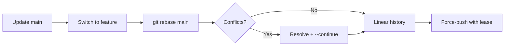

# Module 04 — Rebasing

## What You Will Learn

- How rebase replays your commits on top of another branch for a linear history.
- The step-by-step flow to rebase a feature branch onto an updated `main`.
- **Interactive rebase** to reword, squash, reorder, and drop commits.
- The Golden Rule: never rebase shared commits.

## Why This Module Matters

While you work, `main` keeps moving. Rebase reconciles your branch with it *without* the merge-commit noise — producing a clean, linear log that's easy to read, bisect, and reason about.

## Real-World Use Case

Before opening a PR, you squash three "WIP" commits and a typo-fix into one tidy commit, then rebase onto the latest `main` so the PR applies cleanly.

## Topics Covered

| File | What It Covers |
|------|----------------|
| [rebasing.md](./rebasing.md) | Basic rebase, conflict handling, interactive rebase, squash/reword/drop, rebase vs merge |

## Learning Flow

## Hands-On Practice

Create a feature branch with two commits, add a commit to `main`, then `git rebase main` from the feature branch. Run `git log --graph` before and after to see the line straighten out.

## Common Mistakes

- Rebasing a branch other people are using (rewrites hashes, breaks their clones).
- Using `git push --force` instead of the safer `--force-with-lease`.

## Troubleshooting

- Stuck mid-rebase? `git rebase --abort` returns you to the pre-rebase state.
- Conflict at a commit? Resolve, `git add`, then `git rebase --continue`.

## Best Practices

- Rebase *local, private* commits freely; **merge** *shared, public* ones.
- After a rebase, always `git push --force-with-lease`.

## Quick Revision

- Rebase creates new commit copies (new hashes) on top of the target.
- Interactive rebase cleans up local history before sharing.
- Never rebase commits others may have based work on.

## Next Module

➡️ [05 — Remote Operations](../05-remote-operations/): fetch, pull, push, and tracking.

<!-- NAV-FOOTER -->

---

### 🧭 Navigation

| Previous | Up | Next |
|:---|:---:|---:|
| ⬅️ Prev: [Branching & Merging](../03-branching-and-merging/branching-and-merging.md) | ⬆️ Home: [Git Cheat Sheet](../README.md) | ➡️ Next: [Rebasing](rebasing.md) |
