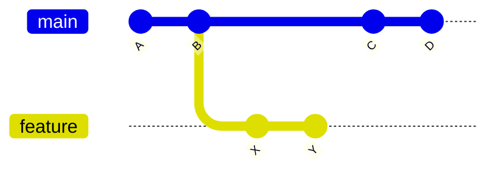
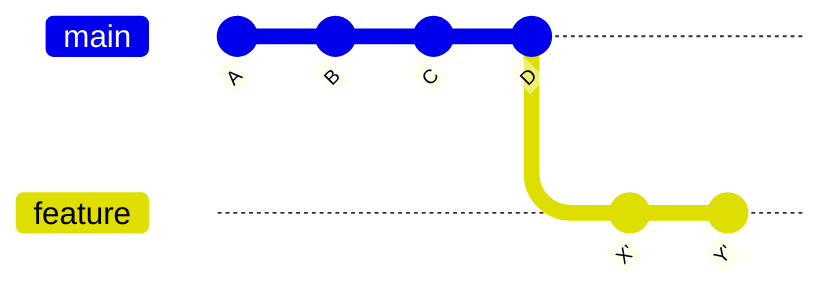
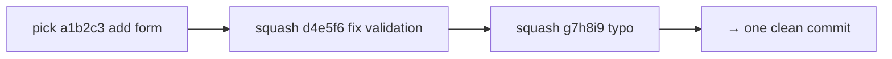

# Rebasing

## 1. What Is This?

Rebase takes the commits on your branch and **replays** them, one by one, on top of the current tip of another branch — producing a linear history instead of a merge commit.

## 2. Why Is This Needed?

When you work on a feature branch for a few days, `main` keeps moving forward. Eventually your branch and `main` diverge. **Merge** joins the two histories with a merge commit — accurate, but it litters the log with "Merge branch 'main'..." noise. **Rebase** instead rewrites your commits as if you'd started from the current `main` today, giving a perfectly linear history that's easier to read, bisect, and reason about.

**When to rebase:** keeping a long-lived feature branch current, cleaning up messy local commits before a PR, producing a tidy linear log.
**When NOT to rebase:** on branches other people use, or when you want to preserve the exact topology of how development happened.

## 3. Simple Layman Explanation

Imagine you started writing notes based on page 5 of a textbook, but a new edition shifted everything to page 12. **Rebasing** is rewriting your notes as if you'd started from page 12 all along — so they slot in cleanly. **Merging** instead staples a "here's how I reconciled the two editions" page onto your notes.

## 4. Technical Explanation

The key fact: rebase doesn't *move* your commits — it **creates brand-new copies** with new hashes and discards the originals. This single fact explains everything: why history looks clean, why you must force-push afterward, and why rebasing shared commits is dangerous (everyone else still has the old commits, now orphaned).

**Before** — branch and `main` diverged:



**After `git rebase main`** — `X`/`Y` become new commits `X'`/`Y'` on top of the latest `main`:



## 5. Real-World Example

Your PR has three commits: "add login form", "fix validation", "typo". Before review you run `git rebase -i HEAD~3`, squash them into one clean "feat: add login form", then rebase onto the latest `main` so it merges without conflicts.

## 6. Diagram

Interactive rebase opens an editor where you change `pick` to an action per commit:



## 7. Commands

```bash
# --- Basic rebase ---
git rebase main                     # rebase current branch onto main
git rebase main feature/login       # rebase a named branch onto main

# --- Step-by-step: feature branch onto updated main ---
git switch main && git pull origin main
git switch feature/login
git rebase main
#   on conflict: edit files, then:
git add src/auth.js
git rebase --continue               # proceed to the next commit
git rebase --skip                   # skip the current commit (rare)
git rebase --abort                  # cancel, restore pre-rebase state

# --- Force-push the rebased branch (history was rewritten) ---
git push --force-with-lease origin feature/login

# --- Interactive rebase ---
git rebase -i HEAD~3                 # edit the last 3 commits
git rebase -i origin/main           # from where the branch diverged
```

In the interactive editor (commits listed oldest-first), change `pick` to:

| Keyword | Short | Action |
|---------|-------|--------|
| `pick`   | `p` | keep unchanged |
| `reword` | `r` | keep, edit message |
| `edit`   | `e` | pause to amend files + message |
| `squash` | `s` | fold into previous, combine messages |
| `fixup`  | `f` | fold into previous, discard this message |
| `drop`   | `d` | remove the commit |

## 8. Command Explanation

- `git rebase main` replays your branch's commits on top of `main`.
- `--continue` / `--skip` / `--abort` drive the rebase when it pauses on conflicts.
- `--force-with-lease` re-pushes the rewritten branch but *refuses* if the remote has commits you haven't seen — safer than `--force`.
- `git rebase -i` opens the todo list where `squash`/`reword`/`drop` reshape history.

## 9. Practice Tasks

1. Diverge a feature branch from `main`, then `git rebase main` and inspect `git log --graph`.
2. Use `git rebase -i HEAD~3` to squash three commits into one.
3. Reword an old commit message with `reword`.

## 10. Common Mistakes

- Rebasing shared branches — everyone else's history breaks.
- Plain `git push --force`, which can clobber a teammate's new commits.
- Forgetting to `git add` resolved files before `--continue`.

## 11. Troubleshooting

- Messy rebase? `git rebase --abort` resets to before it started.
- "Updates were rejected" after rebase → you need `--force-with-lease` (history changed).
- Repeated conflicts across commits → consider a merge instead, or rebase in smaller steps.

## 12. Best Practices

- **The Golden Rule:** never rebase commits that exist outside your machine and that others may have based work on.
- Rebase local/private commits freely; merge for shared/public ones.
- Always follow a branch rebase with `--force-with-lease`.

## 13. Quick Recap

- Rebase = replay commits as new copies on a new base → linear history.
- Interactive rebase cleans up local commits before sharing.
- Force-push with lease after rebasing; never rebase shared history.

## 14. References

- [Pro Git — Rebasing](https://git-scm.com/book/en/v2/Git-Branching-Rebasing) (includes "The Perils of Rebasing")
- [git rebase — official docs](https://git-scm.com/docs/git-rebase)
- [Atlassian — Merging vs. Rebasing](https://www.atlassian.com/git/tutorials/merging-vs-rebasing)
- [Learn Git Branching — Rebase lessons](https://learngitbranching.js.org/)

<!-- NAV-FOOTER -->

---

### 🧭 Navigation

| Previous | Up | Next |
|:---|:---:|---:|
| ⬅️ Prev: [Module 04 — Rebasing](README.md) | ⬆️ Module: [Module 04 — Rebasing](README.md) | ➡️ Next: [Module 05 — Remote Operations](../05-remote-operations/README.md) |
