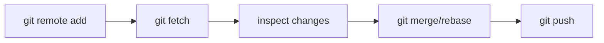

# Module 05 — Remote Operations

## What You Will Learn

- What a remote is and why `origin/main` is only a *snapshot* of the remote.
- How to add, rename, and re-URL remotes.
- The difference between **fetch**, **pull**, and **push** — and why fetch-first is safer.
- How tracking branches enable plain `git push` / `git pull`, plus safe force-pushing.

## Why This Module Matters

Git is distributed, but teams need one shared source of truth. Remotes are how your local work reaches teammates, backups, CI/CD, and code review.

## Real-World Use Case

A teammate pushes while you're offline. You `git fetch`, inspect `git log main..origin/main` to see exactly what they added, then decide whether to merge or rebase — no surprises.

## Topics Covered

| File | What It Covers |
|------|----------------|
| [remote-operations.md](./remote-operations.md) | Managing remotes, fetch/pull/push, remote-tracking branches, force-push, tracking |

## Learning Flow

## Hands-On Practice

Add a remote, `git fetch origin`, then run `git log main..origin/main --oneline` to see what's on the remote that you don't have. Push a branch with `git push -u origin <branch>`.

## Common Mistakes

- Treating `origin/main` as live — it only updates on fetch/pull.
- Using `git push --force` on a shared branch instead of `--force-with-lease`.

## Troubleshooting

- "Updates were rejected" → the remote moved; `git pull` (or rebase) first.
- Plain `git push` fails on a new branch → set upstream with `-u` the first time.

## Best Practices

- Fetch first, inspect, then integrate — don't blind-pull.
- Always prefer `--force-with-lease` over `--force`.

## Quick Revision

- `pull` = `fetch` + `merge` (or `+ rebase`).
- `origin/main` is your last-known snapshot of the remote.
- `-u` sets tracking so later `push`/`pull` need no arguments.

## Next Module

➡️ [06 — Stashing](../06-stashing/): shelve work-in-progress and switch context.

<!-- NAV-FOOTER -->

---

### 🧭 Navigation

| Previous | Up | Next |
|:---|:---:|---:|
| ⬅️ Prev: [Rebasing](../04-rebasing/rebasing.md) | ⬆️ Home: [Git Cheat Sheet](../README.md) | ➡️ Next: [Remote Operations](remote-operations.md) |
