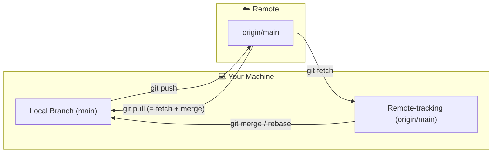
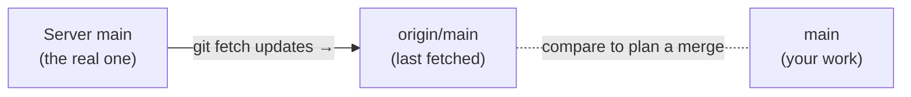

# Remote Operations

## 1. What Is This?

Remotes are named references to repositories hosted elsewhere (GitHub, GitLab, Bitbucket, self-hosted). This covers moving commits between your machine and the remote: fetch, pull, and push.

## 2. Why Is This Needed?

Git is **distributed** — every developer has a complete local copy and can work offline. But teams need a shared, authoritative source of truth that everyone pushes to and pulls from. That shared copy lives on a **remote**, which enables:
- **Collaboration** — teammates push branches and pull each other's work.
- **Backup** — an off-machine copy; losing your laptop doesn't lose the project.
- **CI/CD** — every push can trigger builds, tests, and deployments.
- **Code review** — Pull Requests are opened against a remote.

`git fetch` downloads remote changes without touching your working files; `git pull` = `fetch` + `merge` (or rebase). Fetching first lets you **inspect** what changed before deciding how to integrate it.

## 3. Simple Layman Explanation

The remote is a **shared Google Drive folder** for your team's code. `push` uploads your work, `fetch` downloads the latest *without* changing your local files yet, and `pull` downloads *and* applies it.

`origin/main` is a **photo of the remote** you took the last time you synced — useful, but it doesn't change just because the real thing did. Run `git fetch` to take a fresh photo.

## 4. Technical Explanation

At any moment you have three pointers in play:

| Pointer | What it is |
|---------|-----------|
| `main` | Your local branch — what *you* committed |
| `origin/main` | Your last-known snapshot of the remote's `main` |
| (the real remote) | The actual `main` on the server — only seen via fetch |



The key insight: **`origin/main` only updates when you fetch or pull.** It is not live.

## 5. Real-World Example

```bash
git fetch origin                       # refresh your snapshot of the remote
git log main..origin/main --oneline    # what did the team add that I don't have?
```

You see two new commits, rebase your branch onto them, and push — staying in sync without a messy merge.

## 6. Diagram



## 7. Commands

```bash
# --- Managing remotes ---
git remote -v                                          # list remotes + URLs
git remote add origin https://github.com/user/repo.git
git remote add upstream https://github.com/original/repo.git  # fork workflows
git remote set-url origin git@github.com:user/repo.git # switch HTTPS → SSH
git remote rename origin old-origin
git remote remove upstream

# --- Fetching (safe; never touches your files) ---
git fetch origin
git fetch origin main
git fetch --all
git fetch --prune                                      # drop refs to deleted remote branches
git log HEAD..origin/main --oneline                    # inspect what's new before merging

# --- Pulling (= fetch + merge, or + rebase) ---
git pull origin main
git pull --rebase origin main                          # keep history linear
git pull --ff-only origin main                         # fail rather than make a merge commit

# --- Pushing ---
git push origin feature/login
git push -u origin feature/login                       # set upstream (first time only)
git push --all origin
git push --tags
git push origin --delete feature/login

# --- Force-push (after rebase/rewrite) ---
git push --force-with-lease origin feature/login       # safe: fails if remote moved
git push --force origin feature/login                  # unsafe: overwrites regardless

# --- Tracking branches ---
git branch --set-upstream-to=origin/main main
git branch -vv                                         # show ahead/behind tracking info
```

## 8. Command Explanation

- `git remote add` registers a named URL; `origin` is the conventional name for where you cloned from, `upstream` for the original in a fork.
- `git fetch` downloads new commits into remote-tracking branches only — your work is untouched.
- `git pull` fetches and integrates; `--rebase` and `--ff-only` change *how* it integrates.
- `git push -u` sets the upstream so later plain `git push`/`git pull` work for that branch.
- `--force-with-lease` re-pushes rewritten history but refuses if the remote has unseen commits.

## 9. Practice Tasks

1. `git fetch origin` then `git log HEAD..origin/main --oneline` to see incoming commits.
2. Push a new branch with `git push -u origin <branch>` and confirm `git branch -vv` shows tracking.
3. Try `git pull --rebase` and compare the resulting log to a plain `git pull`.

## 10. Common Mistakes

- Assuming `origin/main` updates automatically — it only moves on fetch/pull.
- `git push --force` on a shared branch, clobbering teammates' commits.
- Forgetting `-u` on a new branch, then being confused why `git push` asks for arguments.

## 11. Troubleshooting

- "Updates were rejected (non-fast-forward)" → the remote moved; `git pull` (or rebase) then push.
- After a rebase, push is rejected → use `--force-with-lease`.
- Deleted-remote branches still showing → `git fetch --prune`.

## 12. Best Practices

- Fetch and inspect before integrating; avoid blind `git pull` on busy branches.
- Use `--force-with-lease`, never bare `--force`, on shared branches.
- Set upstream tracking once with `-u` for smooth pushes/pulls.

## 13. Quick Recap

- `fetch` downloads, `pull` downloads+applies, `push` uploads.
- `origin/main` is a snapshot, refreshed only by fetch.
- Tracking branches make `push`/`pull` argument-free.

## 14. References

- [Pro Git — Working with Remotes](https://git-scm.com/book/en/v2/Git-Basics-Working-with-Remotes)
- [Pro Git — Remote Branches](https://git-scm.com/book/en/v2/Git-Branching-Remote-Branches)
- [git fetch](https://git-scm.com/docs/git-fetch) · [git pull](https://git-scm.com/docs/git-pull) · [git push](https://git-scm.com/docs/git-push)
- [GitHub Docs — About remote repositories](https://docs.github.com/en/get-started/git-basics/about-remote-repositories)

<!-- NAV-FOOTER -->

---

### 🧭 Navigation

| Previous | Up | Next |
|:---|:---:|---:|
| ⬅️ Prev: [Module 05 — Remote Operations](README.md) | ⬆️ Module: [Module 05 — Remote Operations](README.md) | ➡️ Next: [Module 06 — Stashing](../06-stashing/README.md) |
