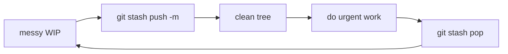

# Module 06 — Stashing

## What You Will Learn

- How to shelve uncommitted work so you can switch context with a clean tree.
- How to save, list, inspect, apply, pop, and drop stashes.
- How to include untracked files and create a branch from a stash.
- The mental model: stashes are hidden commits on a last-in-first-out stack.

## Why This Module Matters

Git won't let you switch branches with conflicting uncommitted changes. Stash is the third option between committing half-done work and discarding it — save it, switch, come back.

## Real-World Use Case

You're mid-feature when a production bug lands. `git stash`, jump to `main`, fix and ship the bug, then `git stash pop` and continue exactly where you left off.

## Topics Covered

| File | What It Covers |
|------|----------------|
| [stashing.md](./stashing.md) | save/push, list/show, apply/pop, drop/clear, stash branch, typical workflow |

## Learning Flow

## Hands-On Practice

Make an edit, `git stash push -m "wip"`, confirm `git status` is clean, switch branches, switch back, then `git stash pop` to restore.

## Common Mistakes

- Forgetting `-u`, so new untracked files aren't stashed.
- Stashing without a message and later not knowing what `stash@{2}` contains.

## Troubleshooting

- Lost track of stashes? `git stash list` then `git stash show -p stash@{n}`.
- `pop` caused conflicts? Resolve them; the stash stays until you confirm with `apply`/`drop`.

## Best Practices

- Always give stashes a `-m` message.
- Prefer `apply` over `pop` when a conflict is likely (keeps the stash as backup).

## Quick Revision

- `stash` saves WIP and cleans the tree; `pop` restores and removes it.
- The stack is LIFO — `stash@{0}` is newest.
- Use `-u` to include untracked files.

## Next Module

➡️ [07 — History & Diffing](../07-history-and-diffing/): query what changed, when, and why.

<!-- NAV-FOOTER -->

---

### 🧭 Navigation

| Previous | Up | Next |
|:---|:---:|---:|
| ⬅️ Prev: [Remote Operations](../05-remote-operations/remote-operations.md) | ⬆️ Home: [Git Cheat Sheet](../README.md) | ➡️ Next: [Stashing](stashing.md) |
