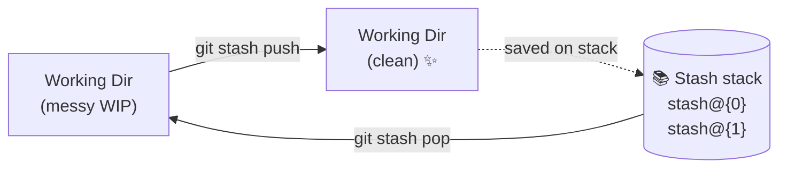
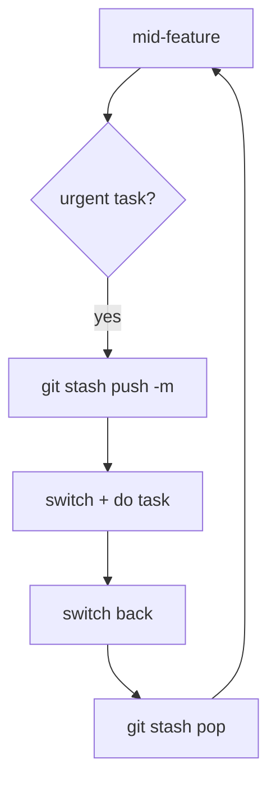

# Stashing

## 1. What Is This?

`git stash` saves the current state of your working directory and staging area to a temporary stack, reverts to a clean tree, and lets you restore everything later exactly as it was.

## 2. Why Is This Needed?

Git won't let you switch branches when uncommitted changes would conflict with the target. Without stash, your options are to commit half-done work (polluting history) or discard it (losing work) — neither is acceptable. Stash gives you a **third option**: shelve the work, get a clean desk, deal with the urgent thing, then bring it back.

**Common scenarios:**
- A production bug lands mid-feature — stash, fix on `main`, pop.
- You started on the wrong branch — stash, switch, pop.
- You want to test clean `main` without committing incomplete work.

## 3. Simple Layman Explanation

You're cooking but the doorbell rings. You slide the half-prepped ingredients into the fridge (`git stash`), answer the door with clean hands, then take everything back out exactly as it was (`git stash pop`).

## 4. Technical Explanation

A stash isn't magic — Git quietly makes *hidden commits* of your changes and stores them on a stack called `refs/stash`. That's why stashes survive branch switches and why each has a real diff you can inspect with `git stash show -p`. The stack is **last-in-first-out**: `stash@{0}` is always the newest.



## 5. Real-World Example

```bash
git stash push -m "WIP: new nav bar"   # shelve feature work
git switch main
git switch -c hotfix/crash-on-login
# ... fix and commit the bug ...
git switch feature/nav
git stash pop                          # resume the nav bar work
```

## 6. Diagram



## 7. Commands

```bash
# --- Saving ---
git stash                                   # stash tracked modified files
git stash push -m "WIP: half-done login"    # with a message (recommended)
git stash push -u -m "WIP: new config"      # include untracked files
git stash push -a -m "WIP: everything"      # include untracked AND ignored
git stash push -m "auth" src/auth.js        # stash only specific files
git stash push -p                           # choose hunks interactively

# --- Viewing ---
git stash list                              # all stashes (newest first)
git stash show stash@{0}                     # summary of a stash
git stash show -p stash@{0}                   # full diff of a stash

# --- Restoring ---
git stash apply                             # apply newest, keep it in the list
git stash apply stash@{1}                    # apply a specific stash
git stash pop                               # apply newest AND remove it
git stash pop stash@{1}                      # apply specific AND remove it

# --- Cleaning up ---
git stash drop stash@{1}                     # remove one stash
git stash clear                             # remove all stashes

# --- Branch from a stash (when it no longer applies cleanly) ---
git stash branch feature/login stash@{0}
```

## 8. Command Explanation

- `git stash push -m` saves WIP with a label; `-u` adds untracked files, `-a` adds ignored too.
- `git stash list` shows the LIFO stack; `show -p` prints the actual diff of an entry.
- `apply` restores but *keeps* the stash; `pop` restores and *removes* it.
- `git stash branch` creates a branch at the commit where the stash was made and applies it — handy when the working branch has moved on.

## 9. Practice Tasks

1. Edit a file, `git stash push -m "test"`, and confirm `git status` is clean.
2. `git stash list`, then `git stash show -p stash@{0}` to inspect it.
3. `git stash pop` and verify your edit returns.

## 10. Common Mistakes

- Forgetting `-u`, so brand-new files aren't stashed and get left behind.
- No `-m` message, then guessing what an old stash contains.
- Using `pop` when a conflict is likely and losing track of the stash.

## 11. Troubleshooting

- Can't find your work? `git stash list` — it may be on the stack.
- `pop` produced conflicts → resolve them; with `apply`, the stash remains as backup until you `drop` it.
- Stash won't apply cleanly → use `git stash branch` to apply it on a fresh branch.

## 12. Best Practices

- Always label stashes with `-m`.
- Prefer `apply` + manual `drop` over `pop` when conflicts are possible.
- Don't hoard stashes — they're easy to forget; clear them when done.

## 13. Quick Recap

- Stash shelves WIP and cleans your tree; restore with `apply`/`pop`.
- It's a LIFO stack of hidden commits; `stash@{0}` is newest.
- `-u` includes untracked files; `stash branch` rescues a non-applying stash.

## 14. References

- [Pro Git — Stashing and Cleaning](https://git-scm.com/book/en/v2/Git-Tools-Stashing-and-Cleaning)
- [git stash — official docs](https://git-scm.com/docs/git-stash)
- [Atlassian — git stash tutorial](https://www.atlassian.com/git/tutorials/saving-changes/git-stash)

<!-- NAV-FOOTER -->

---

### 🧭 Navigation

| Previous | Up | Next |
|:---|:---:|---:|
| ⬅️ Prev: [Module 06 — Stashing](README.md) | ⬆️ Module: [Module 06 — Stashing](README.md) | ➡️ Next: [Module 07 — History & Diffing](../07-history-and-diffing/README.md) |
