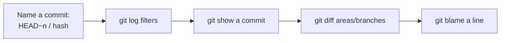

# Module 07 — History & Diffing

## What You Will Learn

- How to name commits: `HEAD`, `HEAD~3`, hashes, branches, tags.
- The crucial difference between `A..B` and `A...B` ranges.
- How to filter `git log` by author, date, message, content, and file.
- How to use `git show`, `git diff`, and `git blame` to inspect changes.

## Why This Module Matters

Git history is a queryable database of *what* changed, *when*, *who*, and (with good messages) *why*. Knowing how to interrogate it is what separates Git from plain backups.

## Real-World Use Case

A feature worked last week and is broken now. `git log -S "functionName"` finds the exact commit that changed it; `git blame` shows who wrote the line and in which commit, so you can read the context.

## Topics Covered

| File | What It Covers |
|------|----------------|
| [history-and-diffing.md](./history-and-diffing.md) | Commit references & ranges, log filters, show, diff (the three pairs), blame |

## Learning Flow

## Hands-On Practice

Run `git log --oneline --graph`, then filter with `--author`, `--grep`, and `-S`. Compare `git diff` vs `git diff --staged` after staging one file.

## Common Mistakes

- Confusing `A..B` (in B not A) with `A...B` (in either but not both).
- Thinking `git diff` shows everything — by default it only shows *unstaged* changes.

## Troubleshooting

- Diff looks empty after staging? You need `git diff --staged`.
- Blame cluttered by formatting commits? Add `-w` to ignore whitespace.

## Best Practices

- Use `git log --oneline --graph --decorate --all` as your default overview.
- Write meaningful commit messages — `git log --grep` is only as good as they are.

## Quick Revision

- `HEAD~n` counts back from where you are.
- `A..B` = what's in B not A; `A...B` = symmetric difference.
- `diff` (unstaged) vs `diff --staged` (staged) vs `diff HEAD` (everything).

## Next Module

➡️ [08 — Undoing Changes](../08-undoing-changes/): restore, reset, revert, reflog.

<!-- NAV-FOOTER -->

---

### 🧭 Navigation

| Previous | Up | Next |
|:---|:---:|---:|
| ⬅️ Prev: [Stashing](../06-stashing/stashing.md) | ⬆️ Home: [Git Cheat Sheet](../README.md) | ➡️ Next: [History & Diffing](history-and-diffing.md) |
