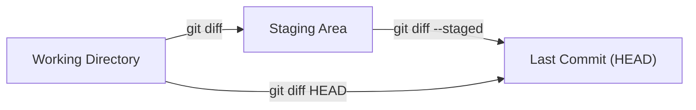

# History & Diffing

## 1. What Is This?

The tools for exploring a repo's recorded history — `git log`, `git show`, `git diff`, and `git blame` — plus the syntax for naming commits and commit ranges.

## 2. Why Is This Needed?

Every commit is a permanent, queryable record — not just of *what* changed, but *when*, *who*, and (with good messages) *why*. Interrogating this history is one of Git's most powerful features:
- **Understand a decision** — `git log -p` and `git blame` show why code was written a certain way.
- **Audit changes** — `git log v1.1.0..v1.2.0` lists what shipped between releases.
- **Find regressions** — `git log -S "functionName"` finds the commit that changed a behavior.
- **Onboard faster** — a file's history reveals intent the code alone doesn't.

`git diff` complements `git log` by showing the *content* of changes rather than just metadata.

## 3. Simple Layman Explanation

`HEAD~2` is like saying "two pages back from where my bookmark is" — you don't need the page number, just count backward from where you are. And `git blame` is the "who wrote this sentence, and in which draft?" tool — not to assign fault, but to find the context.

## 4. Technical Explanation

Before filtering history, you need a way to *name* commits:

| Reference | Means |
|-----------|-------|
| `HEAD` | The commit you're on |
| `HEAD~1` / `HEAD~` | One commit back (parent) |
| `HEAD~3` | Three commits back |
| `HEAD^2` | The **second** parent — only on a merge commit |
| `a1b2c3d` | A specific commit by (short) hash |
| `main`, `v1.2.0` | The commit a branch or tag points to |

**Ranges** trip up everyone:
- `A..B` → commits reachable from **B but not A** ("what's in B that isn't in A yet").
- `A...B` → commits in **either** but **not both** (symmetric difference).


## 5. Real-World Example

```bash
git log main..origin/main --oneline    # what's on the remote I don't have?
git log main..HEAD --oneline           # what have I done that isn't on main yet?
git log v1.1.0..v1.2.0 --oneline       # what shipped between two releases?
```

## 6. Diagram

`git diff` and `git diff --staged` compare *different pairs* of areas — the usual source of confusion:



- `git diff` → "what have I changed but **not staged** yet?"
- `git diff --staged` → "what's **staged** and about to be committed?"
- `git diff HEAD` → "**everything** different from the last commit."

## 7. Commands

```bash
# --- git log ---
git log --oneline                              # one commit per line
git log --oneline --graph --decorate --all     # branch graph (great default)
git log -5                                     # last 5 commits
git log -p                                     # full patch per commit
git log --stat                                 # change stats per commit

# --- Filtering the log ---
git log --author="Prakhar"                     # by author (partial match)
git log --since="2 weeks ago"                  # by date
git log --grep="authentication"                # by message keyword
git log -S "getUserById"                       # by content (added/removed string)
git log -- src/auth.js                         # by file
git log --follow -- src/old-name.js            # follow a renamed file
git log main..feature/login --oneline          # in feature, not in main
git log main...feature/login --left-right      # symmetric difference

# --- git show (inspect one commit/object) ---
git show HEAD
git show a1b2c3
git show HEAD~2
git show --stat HEAD                           # files changed, no full diff
git show a1b2c3:src/auth.js                    # a file as it was at that commit

# --- git diff ---
git diff                                       # unstaged (working dir vs index)
git diff --staged                              # staged (index vs last commit)
git diff main feature/login                    # compare two branches
git diff a1b2c3 d4e5f6                          # compare two commits
git diff --name-only main feature/login        # just file names
git diff --stat main feature/login             # change summary

# --- git blame ---
git blame src/auth.js                          # author + commit per line
git blame -L 15,40 src/auth.js                 # limit to a line range
git blame -w src/auth.js                       # ignore whitespace-only changes
git blame -M src/auth.js                       # detect lines moved within the file
git blame -C src/auth.js                       # detect lines moved from other files
```

## 8. Command Explanation

- `git log` lists commits; flags filter by author/date/message/content/file and draw the graph.
- `-S` (the "pickaxe") finds commits that added or removed an exact string.
- `git show` prints a single commit's metadata and diff, or a file's contents at that commit.
- `git diff` with no args shows unstaged work; `--staged` shows what's about to commit; `HEAD` shows both.
- `git blame` annotates each line with the commit and author that last touched it.

## 9. Practice Tasks

1. Run `git log --oneline --graph --decorate --all` on any repo.
2. Stage one file, then compare `git diff` against `git diff --staged`.
3. `git blame` a file, pick a hash, and `git show` it to read the full change.

## 10. Common Mistakes

- Mixing up `A..B` and `A...B`.
- Expecting `git diff` to show staged changes (it doesn't — use `--staged`).
- Blaming a reformatting commit instead of the real author (use `-w`).

## 11. Troubleshooting

- `git diff` shows nothing after you staged everything → use `git diff --staged`.
- Can't find when a string appeared → `git log -S "string" -p`.
- Renamed file history stops → add `--follow`.

## 12. Best Practices

- Keep `git log --oneline --graph --decorate --all` (alias it as `lg`) as your overview.
- Use ranges to scope reviews: `git diff origin/main...HEAD`.
- Write good commit messages so `--grep` and `log` stay useful.

## 13. Quick Recap

- Name commits with `HEAD~n`, hashes, branches, tags.
- `A..B` = in B not A; `A...B` = in either but not both.
- `diff` = unstaged, `diff --staged` = staged, `diff HEAD` = everything.

## 14. References

- [Pro Git — Viewing the Commit History](https://git-scm.com/book/en/v2/Git-Basics-Viewing-the-Commit-History)
- [Pro Git — Revision Selection](https://git-scm.com/book/en/v2/Git-Tools-Revision-Selection)
- [git log](https://git-scm.com/docs/git-log) · [git diff](https://git-scm.com/docs/git-diff) · [git show](https://git-scm.com/docs/git-show) · [git blame](https://git-scm.com/docs/git-blame)

<!-- NAV-FOOTER -->

---

### 🧭 Navigation

| Previous | Up | Next |
|:---|:---:|---:|
| ⬅️ Prev: [Module 07 — History & Diffing](README.md) | ⬆️ Module: [Module 07 — History & Diffing](README.md) | ➡️ Next: [Module 08 — Undoing Changes](../08-undoing-changes/README.md) |
