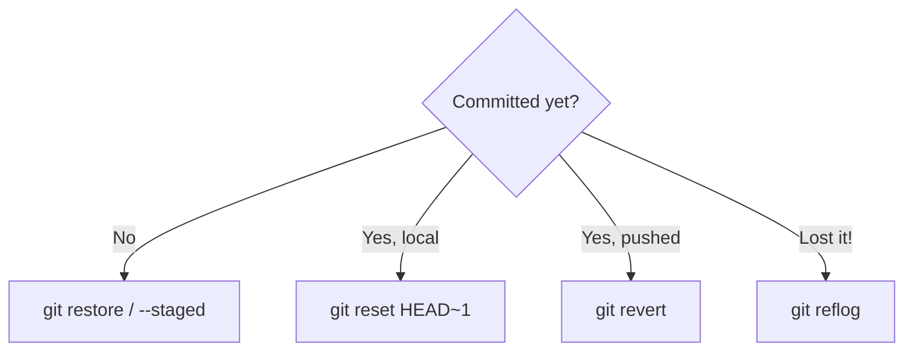

# Module 08 — Undoing Changes

## What You Will Learn

- Which undo tool fits each stage: `restore`, `reset`, `revert`, `reflog`.
- The three `reset` modes (`--soft`, `--mixed`, `--hard`) and what each rewinds.
- Why `revert` is the safe choice on shared branches.
- How `reflog` recovers "lost" commits and branches.

## Why This Module Matters

Mistakes happen at every stage — before staging, after committing, after pushing. Git has a precise tool for each, and the key safety rule is: **rewrite history only before you've shared it.**

## Real-World Use Case

You pushed a broken commit to `main`. You can't safely `reset` shared history, so you `git revert` it — adding a new commit that cancels the change without breaking anyone's clone.

## Topics Covered

| File | What It Covers |
|------|----------------|
| [undoing-changes.md](./undoing-changes.md) | restore (discard/unstage), reset modes, revert, reflog recovery, scenario table |

## Learning Flow

## Hands-On Practice

Make and stage an edit, then `git restore --staged` it. Commit something locally, then `git reset --soft HEAD~1` and watch the change stay staged.

## Common Mistakes

- `git reset --hard` on work you actually wanted (it's destructive).
- Using `reset` to undo a *pushed* commit on a shared branch.

## Troubleshooting

- Think you lost a commit? `git reflog` lists every HEAD movement — recover it.
- Reverted but the change is still there? Make sure you reverted the right commit hash.

## Best Practices

- On shared branches, always `revert`; reserve `reset` for local, unpushed commits.
- Try `--soft`/`--mixed` before reaching for `--hard`.

## Quick Revision

- `restore` = working dir / staging; `reset` = move branch pointer (local only).
- `--soft` keeps staged, `--mixed` unstages, `--hard` wipes.
- `revert` is safe for shared history; `reflog` is your safety net.

## Next Module

➡️ [09 — Tags](../09-tags/): mark releases with permanent pointers.

<!-- NAV-FOOTER -->

---

### 🧭 Navigation

| Previous | Up | Next |
|:---|:---:|---:|
| ⬅️ Prev: [History & Diffing](../07-history-and-diffing/history-and-diffing.md) | ⬆️ Home: [Git Cheat Sheet](../README.md) | ➡️ Next: [Undoing Changes](undoing-changes.md) |
