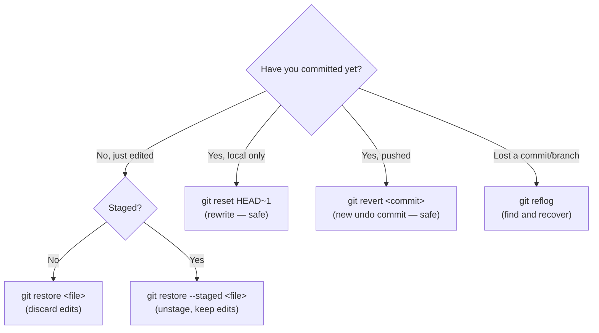
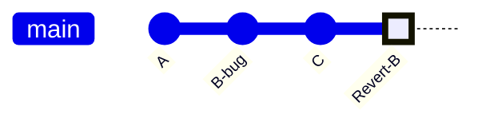
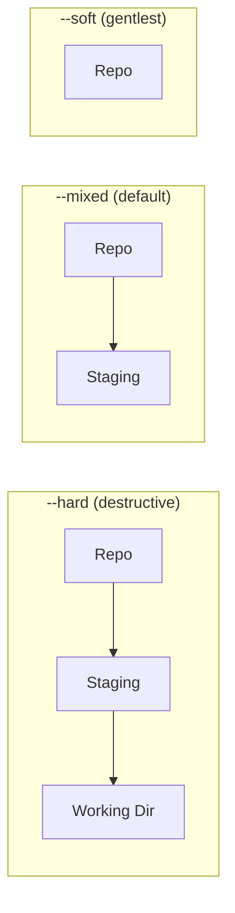

# Undoing Changes

## 1. What Is This?

Git's family of undo tools — `restore`, `reset`, `revert`, and `reflog` — each designed for a different stage of the workflow and a different level of safety.

## 2. Why Is This Needed?

Mistakes happen at different stages — you might catch an error immediately, or only after pushing to `main`. Git's undo tools map to exactly this spectrum:

- **Haven't staged** — `git restore` discards the working-directory change.
- **Staged, not committed** — `git restore --staged` moves it back to the working directory.
- **Committed locally** — `git reset` moves the branch pointer back (safe before pushing).
- **Pushed to a shared branch** — `git revert` adds a commit that reverses the change.
- **Thought it was lost** — `git reflog` records every HEAD movement as a recovery trail.

The key principle: **rewriting history (`reset`, `rebase`) is only safe before you've shared the commits.**

## 3. Simple Layman Explanation

All three `reset` modes hit "undo" on a commit, but differ in how much they throw away: `--soft` keeps your draft on the desk, `--mixed` puts it back in the drawer, `--hard` throws it in the shredder.

`reset` *deletes* history by moving the pointer back; `revert` *adds* a new commit that cancels the old one — nothing is erased, so collaborators are never surprised.

## 4. Technical Explanation

Remember the three areas — Repository, Staging Area, Working Directory. `reset` moves your branch pointer back, then optionally rewinds those areas to match. The mode decides **how many areas** it rewinds:

| Mode | Commits | Staging area | Working directory |
|------|---------|--------------|-------------------|
| `--soft` | Undone | Changes kept **staged** | Untouched |
| `--mixed` (default) | Undone | Staged changes **unstaged** | Untouched |
| `--hard` | Undone | Cleared | **Cleared (destructive)** |



## 5. Real-World Example

You pushed `B-bug` to `main`. Since others may have pulled it, you don't `reset` — you `git revert` it, adding a `Revert-B` commit that undoes the change without rewriting shared history:



## 6. Diagram

How far each `reset` mode rewinds — the further right, the more you lose:



## 7. Commands

```bash
# --- Discard working-directory changes (irreversible) ---
git restore file.txt                  # discard changes in a file
git restore .                         # discard all unstaged changes
git restore --source=HEAD~2 src/auth.js  # restore a file to an older state

# --- Unstage (keep the edits) ---
git restore --staged file.txt
git restore --staged .

# --- Reset: undo local commits ---
git reset --soft HEAD~1               # undo commit, keep changes STAGED
git reset --mixed HEAD~1              # undo commit, keep changes UNSTAGED (default)
git reset --hard HEAD~1               # undo commit AND discard changes (destructive)
git reset --hard a1b2c3               # reset to a specific commit

# --- Revert: undo safely on shared branches ---
git revert HEAD                       # new commit reversing the last one
git revert a1b2c3                     # reverse a specific commit
git revert HEAD~3..HEAD               # reverse a range (oldest first)
git revert -n a1b2c3 && git commit -m "revert: undo broken auth change"

# --- Reflog: recover lost work ---
git reflog                            # every HEAD movement
git reset --hard HEAD@{2}             # jump back to a previous HEAD
git checkout -b recovered HEAD@{5}    # recover a deleted branch
```

## 8. Command Explanation

- `git restore` works on files: plain = discard edits, `--staged` = unstage.
- `git reset` moves the branch pointer back; the mode controls whether staging/working dir are also rewound.
- `git revert` creates a *new* commit that undoes an old one — safe because it adds rather than rewrites.
- `git reflog` logs every position HEAD has held (even after resets/rebases), so "lost" commits are recoverable for ~90 days.

## 9. Practice Tasks

1. Stage a change, then `git restore --staged` it and confirm it's unstaged.
2. Commit locally, run `git reset --soft HEAD~1`, and verify the change is still staged.
3. Run `git reflog` and identify the entry for your last commit.

## 10. Common Mistakes

- `git reset --hard` on work you needed — it's gone (unless reflog still has it).
- Using `reset` to undo a *pushed* commit on a shared branch.
- Reverting the wrong hash and wondering why the bug remains.

## 11. Troubleshooting

- Lost a commit or branch → `git reflog`, find the hash, `git checkout -b` or `git reset --hard` to it.
- `--hard` wiped uncommitted work → if it was never committed, it's likely unrecoverable; commit/stash earlier next time.
- Revert conflicts → resolve like a merge, then `git revert --continue`.

## 12. Best Practices

- On shared branches, always `revert`; reserve `reset` for local, unpushed commits.
- Reach for `--soft`/`--mixed` before `--hard`.
- Commit or stash before risky operations so reflog can save you.

## 13. Quick Recap

- `restore` = files; `reset` = local history; `revert` = safe shared undo.
- `--soft` keeps staged, `--mixed` unstages, `--hard` wipes.
- `reflog` is the safety net for recovering lost work.

## 14. References

- [Pro Git — Undoing Things](https://git-scm.com/book/en/v2/Git-Basics-Undoing-Things)
- [Pro Git — Reset Demystified](https://git-scm.com/book/en/v2/Git-Tools-Reset-Demystified)
- [git restore](https://git-scm.com/docs/git-restore) · [git reset](https://git-scm.com/docs/git-reset) · [git revert](https://git-scm.com/docs/git-revert) · [git reflog](https://git-scm.com/docs/git-reflog)
- [Atlassian — Undoing Changes](https://www.atlassian.com/git/tutorials/undoing-changes)

<!-- NAV-FOOTER -->

---

### 🧭 Navigation

| Previous | Up | Next |
|:---|:---:|---:|
| ⬅️ Prev: [Module 08 — Undoing Changes](README.md) | ⬆️ Module: [Module 08 — Undoing Changes](README.md) | ➡️ Next: [Module 09 — Tags](../09-tags/README.md) |
