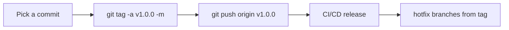

# Module 09 — Tags

## What You Will Learn

- Why tags are permanent pointers (unlike moving branches).
- The difference between **lightweight** and **annotated** tags.
- How to create, list, push, delete, and check out tags.
- Semantic Versioning (`vMAJOR.MINOR.PATCH`) for release tags.

## Why This Module Matters

You need a permanent way to mark "this exact commit shipped as v2.0.0" so it's always findable for reproducible builds, hotfixes, and audits — no matter how far `main` advances.

## Real-World Use Case

A production bug is reported against `v1.4.2`. You branch directly from the tag (`git switch -c hotfix/v1.4.3 v1.4.2`), guaranteeing your fix ships only that release plus the patch.

## Topics Covered

| File | What It Covers |
|------|----------------|
| [tags.md](./tags.md) | Lightweight vs annotated, create/list/push/delete, checkout, SemVer convention |

## Learning Flow

## Hands-On Practice

Create an annotated tag `v0.1.0`, inspect it with `git show v0.1.0`, push it, then check it out and notice the detached-HEAD message.

## Common Mistakes

- Expecting `git push` to send tags — it doesn't; push them explicitly.
- Using lightweight tags for releases (no metadata or signature).

## Troubleshooting

- Tag not on the remote? Run `git push origin <tag>` or `--tags`.
- "detached HEAD" after checkout is expected — create a branch to make changes.

## Best Practices

- Use **annotated** (or signed) tags for anything you ship.
- Follow [SemVer](https://semver.org/): breaking → MAJOR, feature → MINOR, fix → PATCH.

## Quick Revision

- Branches move; tags are pinned forever.
- Annotated tags carry tagger, date, message (and optional signature).
- Tags aren't pushed automatically.

## Next Module

➡️ [10 — Debugging](../10-debugging/): bisect, blame, and pickaxe searches.

<!-- NAV-FOOTER -->

---

### 🧭 Navigation

| Previous | Up | Next |
|:---|:---:|---:|
| ⬅️ Prev: [Undoing Changes](../08-undoing-changes/undoing-changes.md) | ⬆️ Home: [Git Cheat Sheet](../README.md) | ➡️ Next: [Tags](tags.md) |
