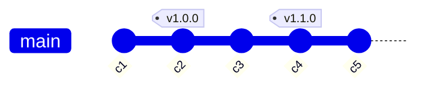
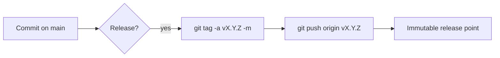

# Tags

## 1. What Is This?

Tags are permanent named pointers to specific commits — most commonly used to mark release versions like `v1.0.0` or `v2.3.1`.

## 2. Why Is This Needed?

Branches are **moving** pointers — `main` advances with every commit. You need a way to permanently mark a specific commit as a release milestone so it's always findable, even after hundreds of later commits. Tags provide that, which is essential for:

- **Reproducible builds** — `git checkout v1.4.2` gives the exact source that shipped.
- **Release automation** — CI/CD can deploy when a new tag is pushed.
- **Hotfix branching** — branch from the tag of the affected release.
- **Auditing** — annotated tags record who cut the release, when, and why.

## 3. Simple Layman Explanation

A branch is like a **bookmark** you keep moving as you read further. A tag is like a **sticky note on page 100** — it marks one exact spot forever, no matter how far you read on.

A **lightweight** tag is just a sticky note with a name. An **annotated** tag is a sticky note *plus* a little card recording who created it, when, and why (and optionally a signature proving it's genuine).

## 4. Technical Explanation

| Type | Description |
|------|-------------|
| **Lightweight** | A simple pointer to a commit — a name, nothing else |
| **Annotated** | A full Git object with message, tagger, date, and optional GPG/SSH signature — recommended for releases |



`main` advances to `c5`, but `v1.0.0` stays pinned to `c2` forever — so `git checkout v1.0.0` always gives that exact release.

## 5. Real-World Example

A bug is reported against `v1.4.2`. You branch from the tag, fix it, and cut `v1.4.3` — shipping only the released code plus the patch, with no half-finished `main` work sneaking in:

```bash
git switch -c hotfix/v1.4.3 v1.4.2
# fix + commit
git tag -a v1.4.3 -m "Hotfix: ..."
git push origin v1.4.3
```

## 6. Diagram



## 7. Commands

```bash
# --- Creating tags ---
git tag v1.0.0                                  # lightweight
git tag -a v1.0.0 -m "Release version 1.0.0"    # annotated (recommended)
git tag -a v0.9.0 a1b2c3 -m "Beta release"      # tag a past commit
git tag -s v1.0.0 -m "Signed release v1.0.0"    # GPG/SSH-signed

# --- Listing & inspecting ---
git tag                                         # list all tags
git tag -l "v1.*"                                # filter by pattern
git show v1.0.0                                  # tag details + tagged commit

# --- Pushing (tags are NOT pushed automatically) ---
git push origin v1.0.0                           # push one tag
git push origin --tags                           # push all tags
git push origin --follow-tags                    # push annotated tags only

# --- Deleting ---
git tag -d v1.0.0                                # delete local tag
git push origin --delete v1.0.0                  # delete remote tag

# --- Checking out (detached HEAD) ---
git checkout v1.0.0                              # inspect a release
git checkout -b hotfix/v1.0.1 v1.0.0            # branch from a tag to make changes
```

## 8. Command Explanation

- `git tag -a -m` creates an annotated tag with metadata; plain `git tag <name>` is lightweight.
- `git tag -s` signs the tag cryptographically for verifiable releases.
- `git show <tag>` displays the tag's message/tagger (annotated) and the commit it points to.
- Tags must be pushed explicitly — `--tags` or `--follow-tags`.
- Checking out a tag detaches HEAD; create a branch from it to commit.

## 9. Practice Tasks

1. Create an annotated `v0.1.0` and inspect it with `git show v0.1.0`.
2. Push it with `git push origin v0.1.0`.
3. Check it out, observe detached HEAD, then branch from it with `git checkout -b test v0.1.0`.

## 10. Common Mistakes

- Assuming `git push` sends tags — it doesn't.
- Using lightweight tags for releases (no tagger, date, or signature).
- Committing while in detached HEAD without creating a branch first (commits get orphaned).

## 11. Troubleshooting

- Tag missing on remote → `git push origin <tag>`.
- Deleted a tag but it's still on the remote → `git push origin --delete <tag>`.
- "detached HEAD" warning → expected after checking out a tag; branch off to make changes.

## 12. Best Practices

- Use annotated or signed tags for everything you ship.
- Follow [Semantic Versioning](https://semver.org/): `vMAJOR.MINOR.PATCH`.
- Tie each production deploy to a tag for rollback and audit.

| Segment | When to increment |
|---------|-------------------|
| MAJOR | Breaking changes |
| MINOR | New features, backwards compatible |
| PATCH | Bug fixes, backwards compatible |

## 13. Quick Recap

- Tags pin a commit permanently; branches keep moving.
- Annotated/signed tags carry metadata — use them for releases.
- Push tags explicitly; check out tags into a branch to edit.

## 14. References

- [Pro Git — Tagging](https://git-scm.com/book/en/v2/Git-Basics-Tagging)
- [git tag — official docs](https://git-scm.com/docs/git-tag)
- [Semantic Versioning (SemVer)](https://semver.org/)
- [GitHub Docs — Managing releases](https://docs.github.com/en/repositories/releasing-projects-on-github/managing-releases-in-a-repository)

<!-- NAV-FOOTER -->

---

### 🧭 Navigation

| Previous | Up | Next |
|:---|:---:|---:|
| ⬅️ Prev: [Module 09 — Tags](README.md) | ⬆️ Module: [Module 09 — Tags](README.md) | ➡️ Next: [Module 10 — Debugging](../10-debugging/README.md) |
