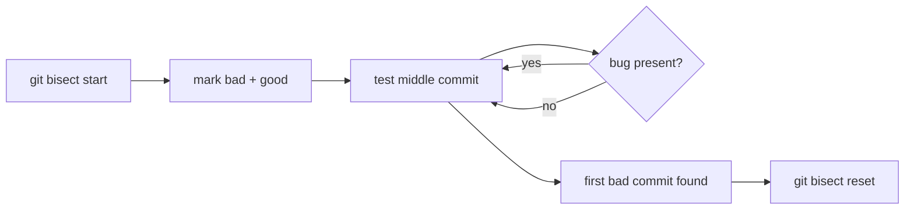

# Module 10 — Debugging

## What You Will Learn

- How `git bisect` binary-searches history to find the commit that introduced a bug.
- How to automate bisect with a test script.
- How `git blame` reveals line-by-line authorship and context.
- How `git log -S` / `-L` track when code or a function changed.

## Why This Module Matters

Traditional debuggers answer "what is the code doing now"; Git's debugging tools answer "what changed and when." For a 1,000-commit range, bisect finds the culprit in ~10 steps instead of reading every commit.

## Real-World Use Case

A feature that worked in `v1.2.0` is broken in production. You `git bisect` between the good tag and now, testing each checkout Git hands you, and land on the exact breaking commit.

## Topics Covered

| File | What It Covers |
|------|----------------|
| [debugging.md](./debugging.md) | bisect (manual + automated), blame, log -S pickaxe, log -L, debug queries |

## Learning Flow

## Hands-On Practice

In any repo, `git blame` a file and pick a line's commit hash, then `git show` it. Try `git log -S "someString"` to find when that string entered the codebase.

## Common Mistakes

- Running bisect on a bug that only reproduces *sometimes* — answers become unreliable.
- Forgetting `git bisect reset`, leaving yourself on a detached commit.

## Troubleshooting

- Bisect pointing at the wrong commit → your good/bad test wasn't deterministic.
- `blame` cluttered by reformatting → use `-w` to ignore whitespace.

## Best Practices

- Reproduce the bug reliably *before* starting bisect.
- Automate with `git bisect run <test>` whenever you have a pass/fail script.

## Quick Revision

- bisect = binary search for the breaking commit (log₂N steps).
- blame = who/when for each line; pickaxe (`-S`) = when a string changed.
- Always `git bisect reset` when done.

## Next Module

➡️ [11 — Collaboration Workflows](../11-workflows/): fork/PR and feature-branch flows.

<!-- NAV-FOOTER -->

---

### 🧭 Navigation

| Previous | Up | Next |
|:---|:---:|---:|
| ⬅️ Prev: [Tags](../09-tags/tags.md) | ⬆️ Home: [Git Cheat Sheet](../README.md) | ➡️ Next: [Debugging](debugging.md) |
