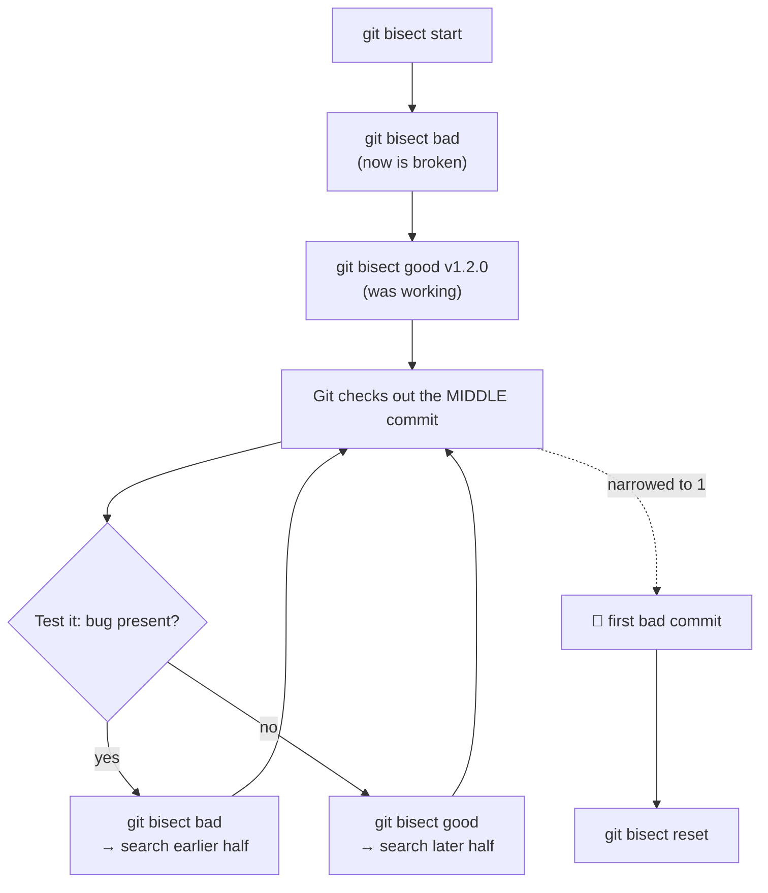
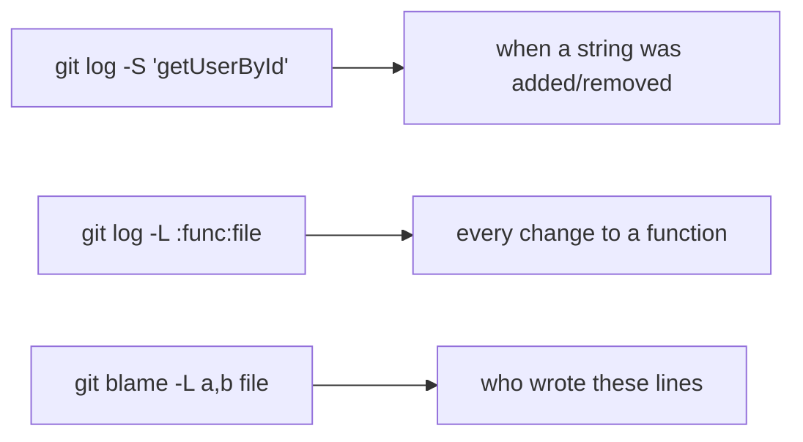

# Debugging

## 1. What Is This?

Git's history-based debugging tools — `git bisect`, `git blame`, and `git log -S`/`-L` — for finding *when* a bug was introduced, *who* changed a line, and *which* commit is responsible.

## 2. Why Is This Needed?

When a bug appears in production, the first questions are "when did this start?" and "what changed?" Traditional debuggers answer "what is the code doing now" — Git's tools answer "what changed and when."

- **`git bisect`** — tell Git a known-good and known-bad commit; it binary-searches the history, checking out commits for you to test. For 1,000 commits, it finds the culprit in ~10 steps.
- **`git blame`** — "who wrote this line and when?" — to find the commit and read its context.
- **`git log -S`** (the pickaxe) — "when did this string or function appear or disappear?"

## 3. Simple Layman Explanation

Bisect is the "guess the number" game. Instead of checking 1,000 commits one by one, Git jumps to the middle and asks "is the bug here?" Each answer halves the remaining suspects — so 1,000 commits are narrowed down in about 10 questions.

## 4. Technical Explanation

`bisect` performs a binary search; for N commits it takes only log₂(N) steps. Two things you need before starting:

1. **A "good" commit** — a point where you *know* the bug didn't exist (often a release tag).
2. **A reliable test** — a repeatable way to answer "is the bug here?" If the bug appears only *sometimes*, your good/bad answers won't be trustworthy and bisect will mislead you. Reproduce it consistently first.



## 5. Real-World Example

```bash
git bisect start
git bisect bad                 # current state is broken
git bisect good v1.2.0         # this release worked
# Git checks out the midpoint — test, then answer good/bad, repeat...
# → "a1b2c3 is the first bad commit"
git bisect reset               # return to your branch
```

## 6. Diagram

The pickaxe and line-log queries turn history into a searchable database:



## 7. Commands

```bash
# --- git bisect (manual) ---
git bisect start
git bisect bad                       # mark current state broken
git bisect good v1.2.0               # mark a known-good commit/tag/hash
git bisect good                      # this checkout is fine — bug came later
git bisect bad                       # this checkout has the bug — earlier
git bisect reset                     # end session, return to original branch

# --- git bisect (automated) ---
git bisect start
git bisect bad HEAD
git bisect good v1.2.0
git bisect run npm test              # or ./test.sh — 0 = good, non-zero = bad
git bisect reset

# --- git blame ---
git blame src/auth.js                # author + commit per line
git blame -L 20,45 src/auth.js       # limit to a line range
git blame -w src/auth.js             # ignore whitespace-only changes
git blame -M src/auth.js             # detect lines moved within the file
git blame -C src/auth.js             # detect lines moved from another file

# --- git log for debugging ---
git log -S "getUserById" --oneline   # commits that added/removed a string (pickaxe)
git log -S "getUserById" -p          # ...with the full patch
git log -L :getUserById:src/user.js  # trace changes to a function
git log -L 40,80:src/user.js         # ...by line range
git log --follow -- src/auth.js      # all commits touching a file (through renames)
git log --grep="security" --oneline  # commits matching a message keyword
git log v1.1.0..v1.2.0 --oneline     # what changed between releases
```

## 8. Command Explanation

- `git bisect good/bad` drive the binary search; `git bisect run <cmd>` automates it with a pass/fail script.
- `git blame` annotates each line with the last commit/author to touch it; `-w`/`-M`/`-C` reduce noise from reformatting and moves.
- `git log -S` finds commits where a string's count changed; `-L` tracks a function or line range over time.
- `git bisect reset` is mandatory cleanup — it returns you from the detached bisect state.

## 9. Practice Tasks

1. `git blame` a file, take a hash, and `git show` it to read the full change.
2. Use `git log -S "<string>"` to find when a string entered the codebase.
3. Run a manual bisect between an old tag and `HEAD` on a toy bug.

## 10. Common Mistakes

- Bisecting an intermittent bug — non-deterministic answers point at the wrong commit.
- Forgetting `git bisect reset`, leaving yourself in detached HEAD.
- Blaming a formatting commit instead of the author (use `-w`).

## 11. Troubleshooting

- Bisect blames a clearly-innocent commit → your test wasn't deterministic; reproduce reliably and retry.
- `bisect run` always reports bad → check the script's exit codes (0 = good).
- Stuck mid-bisect → `git bisect reset` to bail out safely.

## 12. Best Practices

- Make the bug reproducible before bisecting.
- Automate with `git bisect run` whenever a test script exists.
- Use `blame -w` and the pickaxe together to find both *who* and *when*.

## 13. Quick Recap

- bisect = binary search for the first bad commit; reset when done.
- blame = per-line authorship; pickaxe (`-S`) = when a string changed.
- `log -L` traces a function's history.

## 14. References

- [Pro Git — Debugging with Git](https://git-scm.com/book/en/v2/Git-Tools-Debugging-with-Git)
- [git bisect](https://git-scm.com/docs/git-bisect) · [git blame](https://git-scm.com/docs/git-blame) · [git log](https://git-scm.com/docs/git-log)
- [The pickaxe (`log -S`) explained](https://git-scm.com/docs/git-log#Documentation/git-log.txt--Sltstringgt)

<!-- NAV-FOOTER -->

---

### 🧭 Navigation

| Previous | Up | Next |
|:---|:---:|---:|
| ⬅️ Prev: [Module 10 — Debugging](README.md) | ⬆️ Module: [Module 10 — Debugging](README.md) | ➡️ Next: [Module 11 — Collaboration Workflows](../11-workflows/README.md) |
