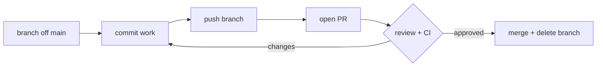

# Module 11 — Collaboration Workflows

## What You Will Learn

- The **Fork & Pull Request** workflow for open-source / external contributors.
- The **Feature Branch** workflow for teams with shared repo access.
- How `origin` and `upstream` differ in a fork.
- A pre-PR code-review checklist.

## Why This Module Matters

Git is just a tool — it doesn't enforce *how* teams use it. A workflow is the shared convention that keeps `main` stable: which branches exist, how work flows, and what gates (review, CI) must pass before merge.

## Real-World Use Case

You want to fix a typo in a popular open-source project you can't push to. You fork it, branch, commit, push to your fork, and open a PR to upstream — the maintainers review and merge.

## Topics Covered

| File | What It Covers |
|------|----------------|
| [workflows.md](./workflows.md) | Fork & PR flow, Feature Branch flow, keeping branches current, PR checklist |

## Learning Flow

## Hands-On Practice

Fork any public repo, add it as `upstream`, create a branch, and open a (draft) PR. Practice syncing with `git fetch upstream && git merge upstream/main`.

## Common Mistakes

- Trying to push directly to `upstream` (you can't — that's the point of forking).
- Opening a PR from a branch that's behind `main`, causing avoidable conflicts.

## Troubleshooting

- PR shows unexpected commits → your branch isn't rebased on the latest `main`.
- Can't push to upstream → push to `origin` (your fork) and open a PR instead.

## Best Practices

- `main` is protected; nothing lands without review.
- Keep branches current (`fetch` + `rebase`) to avoid a giant end-of-life merge.

## Quick Revision

- Fork flow: pull from `upstream`, push to `origin`, PR `origin → upstream`.
- Feature flow: branch → PR → review/CI → merge → delete.
- Both protect `main` behind review.

## Next Module

➡️ [12 — Advanced Commands](../12-advanced/): cherry-pick, worktrees, submodules, LFS.

<!-- NAV-FOOTER -->

---

### 🧭 Navigation

| Previous | Up | Next |
|:---|:---:|---:|
| ⬅️ Prev: [Debugging](../10-debugging/debugging.md) | ⬆️ Home: [Git Cheat Sheet](../README.md) | ➡️ Next: [Collaboration Workflows](workflows.md) |
