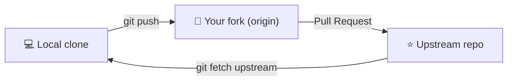
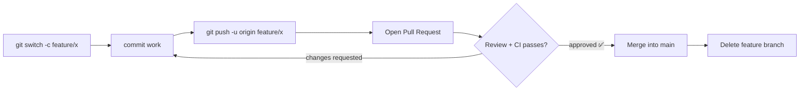

# Collaboration Workflows

## 1. What Is This?

Conventions a whole team follows for how work moves through Git — which branches exist, how changes get reviewed, and what must pass before code reaches `main`. The two most common are **Fork & Pull Request** and **Feature Branch**.

## 2. Why Is This Needed?

Git itself doesn't enforce how teams use it. Without an agreed workflow, you get commits straight to `main`, broken builds, untested code in production, and hours-long conflicts. A workflow makes the implicit explicit so everyone knows what to do.

- **Fork & Pull Request** — for open-source and external contributors without write access. Changes are proposed from a personal fork and reviewed before acceptance, protecting the upstream repo.
- **Feature Branch** — for teams with shared repo access. Every piece of work lives on its own branch and goes through a PR before merging.

Both enforce the same core principle: **`main` is protected, and nothing lands without review.**

## 3. Simple Layman Explanation

The fork model: you can't edit someone else's published book directly. So you photocopy it (fork), make edits on the copy, and mail the author a "please consider these changes" letter (Pull Request). They decide whether to include it.

## 4. Technical Explanation

In a fork workflow you juggle **two** remotes:

| Remote | Points to | You use it to |
|--------|-----------|---------------|
| `origin` | **Your fork** | `push` your branches (you have write access here) |
| `upstream` | **The original repo** | `fetch` the latest changes from maintainers |

The rhythm: **pull *down* from `upstream`, push *up* to `origin`, then open a PR `origin → upstream`.** You can't push to `upstream` directly — that's the whole point.



## 5. Real-World Example — Fork & PR

```bash
# 1. Fork on GitHub, clone your fork
git clone https://github.com/you/repo.git && cd repo

# 2. Add the original as 'upstream'
git remote add upstream https://github.com/original/repo.git

# 3. Sync your fork's main with upstream
git fetch upstream
git switch main && git merge upstream/main
git push origin main

# 4. Branch, commit, push to your fork
git switch -c fix/typo-in-readme
git commit -am "docs: fix typo in installation section"
git push -u origin fix/typo-in-readme

# 5. Open a PR on GitHub: your fork's branch → upstream main
# 6. After merge, clean up
git switch main && git fetch upstream && git merge upstream/main
git push origin main
git branch -d fix/typo-in-readme
```

## 6. Diagram — Feature Branch flow



## 7. Commands

```bash
# --- Feature Branch workflow ---
git switch main && git pull origin main          # 1. start from up-to-date main
git switch -c feature/user-authentication        # 2. create a feature branch
git commit -m "feat: add JWT generation"         # 3. small, focused commits
git fetch origin && git rebase origin/main       # 4. keep current while you work
git push -u origin feature/user-authentication   # 5. push + open PR
git commit -m "fix: handle expired token" && git push  # 6. address review
git switch main && git pull origin main          # 7. after merge, clean up
git branch -d feature/user-authentication
git push origin --delete feature/user-authentication

# --- Keeping a branch up to date (pick one) ---
git fetch origin && git merge origin/main        # merge approach (preserves history)
git fetch origin && git rebase origin/main       # rebase approach (linear) → force-with-lease

# --- Pre-PR checklist ---
git diff origin/main...HEAD                       # review your own changes
git fetch origin && git rebase origin/main        # ensure up to date
git rebase -i origin/main                          # tidy commit history
git push -u origin feature/your-branch             # push
```

## 8. Command Explanation

- `git remote add upstream <url>` registers the original repo so you can sync from it.
- `git merge upstream/main` (or `rebase`) brings the maintainers' latest into your fork.
- In the feature flow, frequent `git rebase origin/main` keeps the branch current and avoids a painful end-of-life merge.
- `git diff origin/main...HEAD` shows exactly what your PR will contain.

## 9. Practice Tasks

1. Fork a public repo, clone it, and add `upstream`.
2. Create a branch, commit, push to `origin`, and open a draft PR.
3. Sync your fork with `git fetch upstream && git merge upstream/main`.

## 10. Common Mistakes

- Trying to push to `upstream` directly.
- Opening a PR from a stale branch, causing avoidable conflicts.
- Mixing many unrelated changes into one PR, making review hard.

## 11. Troubleshooting

- PR shows commits you didn't write → rebase your branch onto the latest `main`.
- Can't push to the original repo → push to your fork (`origin`) and open a PR.
- Diverged fork → `git fetch upstream` then merge/rebase `upstream/main`.

## 12. Best Practices

- Protect `main`; require review + CI before merge.
- Keep branches short-lived and rebased on the latest `main`.
- Review your own diff before requesting review.

## 13. Quick Recap

- Fork flow: pull from `upstream`, push to `origin`, PR `origin → upstream`.
- Feature flow: branch → PR → review/CI → merge → delete.
- Keep branches current to minimize conflicts.

## 14. References

- [Pro Git — Distributed Workflows](https://git-scm.com/book/en/v2/Distributed-Git-Distributed-Workflows)
- [Pro Git — Contributing to a Project](https://git-scm.com/book/en/v2/Distributed-Git-Contributing-to-a-Project)
- [GitHub Flow — official guide](https://docs.github.com/en/get-started/using-github/github-flow)
- [Atlassian — Comparing Git workflows](https://www.atlassian.com/git/tutorials/comparing-workflows)

<!-- NAV-FOOTER -->

---

### 🧭 Navigation

| Previous | Up | Next |
|:---|:---:|---:|
| ⬅️ Prev: [Module 11 — Collaboration Workflows](README.md) | ⬆️ Module: [Module 11 — Collaboration Workflows](README.md) | ➡️ Next: [Module 12 — Advanced Commands](../12-advanced/README.md) |
