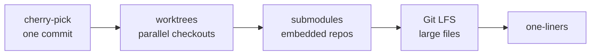

# Module 12 — Advanced Commands

## What You Will Learn

- `cherry-pick` to apply one specific commit across branches.
- `worktrees` to check out multiple branches at once in separate directories.
- `submodules` to embed another repo at a pinned commit.
- `git LFS` for large binaries, plus power-user one-liners.

## Why This Module Matters

The basics cover 90% of daily work. These commands solve the hard 10% — backporting a single fix, working on two things at once, vendoring dependencies, and handling files Git's object store isn't built for.

## Real-World Use Case

A critical fix lands on `main` but a `release/1.x` branch still needs it. You `git cherry-pick <hash>` to backport just that one commit — without dragging in everything else on `main`.

## Topics Covered

| File | What It Covers |
|------|----------------|
| [advanced.md](./advanced.md) | cherry-pick, reflog, worktrees, submodules, Git LFS, useful one-liners |

## Learning Flow

## Hands-On Practice

Create a worktree with `git worktree add ../review pr-branch`, do something there, then `git worktree remove ../review`. Cherry-pick a commit between two local branches.

## Common Mistakes

- Cherry-picking many commits (creates duplicate history) instead of merging/rebasing.
- Using submodules where a package manager would be simpler.

## Troubleshooting

- Submodule folder empty after clone → `git submodule update --init --recursive`.
- Large file rejected by GitHub → track it with Git LFS (files > 100 MB are blocked).

## Best Practices

- Cherry-pick a commit or two; merge/rebase for everything else.
- Reserve submodules for deps a package manager can't handle.

## Quick Revision

- cherry-pick copies a commit (new hash) onto your branch.
- worktrees give multiple working dirs from one `.git`.
- LFS stores big binaries outside history, keeping clones lean.

## Next Module

➡️ [13 — Production Best Practices](../13-production/): protection, signing, secrets, releases.

<!-- NAV-FOOTER -->

---

### 🧭 Navigation

| Previous | Up | Next |
|:---|:---:|---:|
| ⬅️ Prev: [Collaboration Workflows](../11-workflows/workflows.md) | ⬆️ Home: [Git Cheat Sheet](../README.md) | ➡️ Next: [Advanced Commands](advanced.md) |
