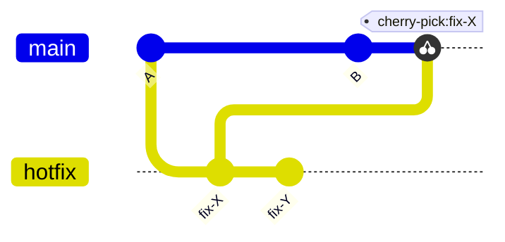
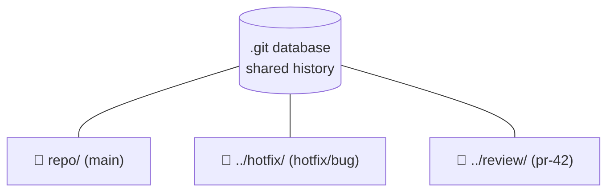
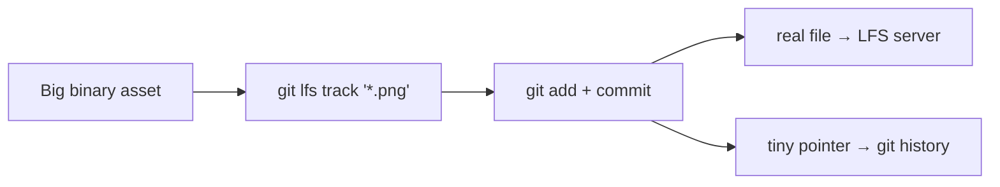

# Advanced Commands

## 1. What Is This?

Power-user Git: applying single commits across branches (`cherry-pick`), multiple simultaneous checkouts (`worktrees`), embedded repositories (`submodules`), large-file handling (`Git LFS`), and a set of useful one-liners.

## 2. Why Is This Needed?

The core commands cover 90% of daily work. These exist to solve problems the basics can't handle elegantly — applying a single fix across multiple branches, working on two things at once without switching, embedding dependencies, and pushing content Git's object store isn't designed for.

## 3. Simple Layman Explanation

- **cherry-pick** is copy-pasting one paragraph from another document into yours — just the part you need, not the whole file.
- **worktrees** are one filing cabinet (the shared `.git`) with several desks (working directories) — a different file open on each desk at once.
- **submodules** are a bookmark to another book pinned to an exact page.
- **LFS** keeps the heavy attachments on a separate shelf and leaves a slip of paper in the repo.

## 4. Technical Explanation

**cherry-pick** copies a commit's *diff* and applies it as a **new commit with a new hash** on your current branch — the original stays put. This is why cherry-picking and *then* merging the same branch can make a change appear twice. Rule of thumb: cherry-pick a commit or two; merge/rebase for everything else.



**worktrees** let one clone check out multiple branches simultaneously, each in its own directory, all sharing the same `.git` database:



## 5. Real-World Example

A bug is fixed on `main` and must be backported to a `release/1.x` maintenance branch:

```bash
git switch release/1.x
git cherry-pick a1b2c3        # apply just that fix
git push origin release/1.x
```

Meanwhile you review a colleague's PR without disturbing your work:

```bash
git worktree add ../review pr-42-branch
cd ../review                  # test the PR here; your main checkout is untouched
```

## 6. Diagram



## 7. Commands

```bash
# --- cherry-pick ---
git cherry-pick a1b2c3                  # apply one commit to current branch
git cherry-pick a1b2c3^..d4e5f6         # apply a range (inclusive)
git cherry-pick -n a1b2c3               # apply without committing
git cherry-pick --continue              # after resolving a conflict
git cherry-pick --abort

# --- reflog (safety net) ---
git reflog                              # every HEAD position
git reset --hard HEAD@{3}               # jump back to a previous state
git checkout -b recovered HEAD@{5}      # recover a deleted branch

# --- worktrees ---
git worktree add ../hotfix hotfix/critical-bug   # checkout a branch elsewhere
git worktree add -b experiment ../exp main       # new branch + worktree
git worktree list
git worktree remove ../hotfix
git worktree prune                      # clean up stale references

# --- submodules ---
git submodule add https://github.com/user/lib.git libs/lib
git clone --recurse-submodules https://github.com/user/repo.git
git submodule update --init --recursive # populate after a plain clone
git submodule update --remote --merge   # update to latest remote commit
git submodule foreach git pull origin main

# --- Git LFS ---
git lfs install                         # one-time, per user
git lfs track "*.png"                   # manage a file type (writes .gitattributes)
git add .gitattributes
git lfs ls-files                        # files currently in LFS
git lfs migrate import --include="*.png" --everything  # move existing files (rewrites history)

# --- Useful one-liners ---
git branch --merged main                # branches safe to delete
git clean -nd                           # dry-run: show untracked files to remove
git clean -fd                           # remove untracked files + dirs
git archive --format=zip HEAD > release.zip   # export without .git
git shortlog -sn --all                  # commit count per author
git count-objects -vH                   # repo object sizes
```

## 8. Command Explanation

- `git cherry-pick` copies a commit onto the current branch; `-n` stages without committing.
- `git reflog` records every HEAD movement so resets, rebases, and deletions are recoverable for ~90 days.
- `git worktree add` creates a second working directory on a different branch, sharing one `.git`.
- `git submodule` pins a dependency repo at an exact commit; remember `--recurse-submodules` on clone.
- `git lfs track` stores big binaries on an LFS server, leaving only a pointer in history.

## 9. Practice Tasks

1. Cherry-pick a commit from one local branch to another.
2. Create a worktree, make a commit in it, then remove the worktree.
3. Run `git reflog` and recover a "deleted" branch with `git checkout -b`.

## 10. Common Mistakes

- Cherry-picking many commits instead of merging/rebasing → duplicate, confusing history.
- Using submodules when npm/pip/cargo/go-modules would be simpler.
- Committing large binaries without LFS, bloating every future clone.

## 11. Troubleshooting

- Submodule directories empty → `git submodule update --init --recursive`.
- GitHub blocks a >100 MB file → track it with Git LFS (and migrate if already committed).
- After `git lfs migrate`, teammates have broken pointers → they must re-clone or `git lfs fetch --all`.

## 12. Best Practices

- Cherry-pick sparingly; prefer merge/rebase for whole branches.
- Reserve submodules for deps a package manager can't handle.
- Always dry-run `git clean -nd` before `git clean -fd`.

## 13. Quick Recap

- cherry-pick copies a commit (new hash) onto your branch.
- worktrees = multiple working dirs from one repo.
- submodules pin external repos; LFS keeps large files out of history.

## 14. References

- [git cherry-pick](https://git-scm.com/docs/git-cherry-pick) · [git worktree](https://git-scm.com/docs/git-worktree)
- [Pro Git — Submodules](https://git-scm.com/book/en/v2/Git-Tools-Submodules)
- [Git Large File Storage (LFS)](https://git-lfs.com/) · [GitHub Docs — About Git LFS](https://docs.github.com/en/repositories/working-with-files/managing-large-files/about-git-large-file-storage)
- [BFG Repo-Cleaner](https://rtyley.github.io/bfg-repo-cleaner/)

<!-- NAV-FOOTER -->

---

### 🧭 Navigation

| Previous | Up | Next |
|:---|:---:|---:|
| ⬅️ Prev: [Module 12 — Advanced Commands](README.md) | ⬆️ Module: [Module 12 — Advanced Commands](README.md) | ➡️ Next: [Module 13 — Production Best Practices](../13-production/README.md) |
