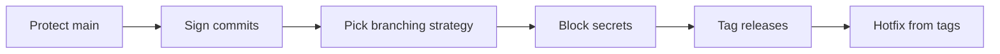

# Module 13 — Production Best Practices

## What You Will Learn

- Branch protection rules that keep `main` always deployable.
- Commit signing (SSH/GPG) for a tamper-evident audit trail.
- Branching strategies: trunk-based vs Gitflow.
- Keeping secrets out of history, PR merge strategies, atomic commits, hooks, release tagging, and hotfixes.

## Why This Module Matters

In development a bad commit is an inconvenience; in production it can mean downtime, data loss, or a breach. These practices exist because production has no free undo.

## Real-World Use Case

A critical bug hits production `v2.1.0`. You branch from the *tag* (not `main`), apply a minimal fix, tag `v2.1.1`, deploy, then merge the fix back into `main` and `develop` — shipping only the fix, nothing half-finished.

## Topics Covered

| File | What It Covers |
|------|----------------|
| [production.md](./production.md) | Branch protection, signing, trunk/Gitflow, secrets, merge strategies, atomic commits, hooks, release tagging, hotfix procedure, audit |

## Learning Flow

## Hands-On Practice

Enable SSH commit signing locally (`commit.gpgsign true`), make a signed commit, and verify it with `git log --show-signature -1`.

## Common Mistakes

- Believing a `revert` removes a committed secret — the history (and clones) still have it.
- Branching a hotfix from `main` (which may contain unreleased work) instead of the release tag.

## Troubleshooting

- Commits show "unverified" on GitHub → add your signing key and enable Vigilant mode.
- Secret committed → rotate it immediately, then scrub history with `git filter-repo`.

## Best Practices

- `main` is always deployable; every change is reviewed and signed.
- Secrets never enter the repo — prevent with `.gitignore` + pre-commit scanning.

## Quick Revision

- Protect branches; require review + green CI before merge.
- Sign commits/tags for a verifiable audit trail.
- Tag every release; hotfix from the tag; never trust revert to erase secrets.

## Next Section

➡️ [Diagrams](../diagrams/): every Mermaid diagram in one visual reference.

<!-- NAV-FOOTER -->

---

### 🧭 Navigation

| Previous | Up | Next |
|:---|:---:|---:|
| ⬅️ Prev: [Advanced Commands](../12-advanced/advanced.md) | ⬆️ Home: [Git Cheat Sheet](../README.md) | ➡️ Next: [Production Best Practices](production.md) |
