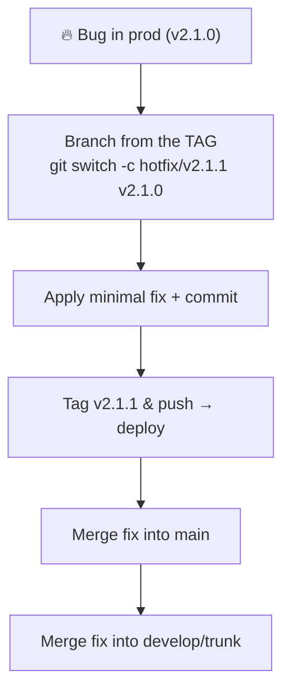
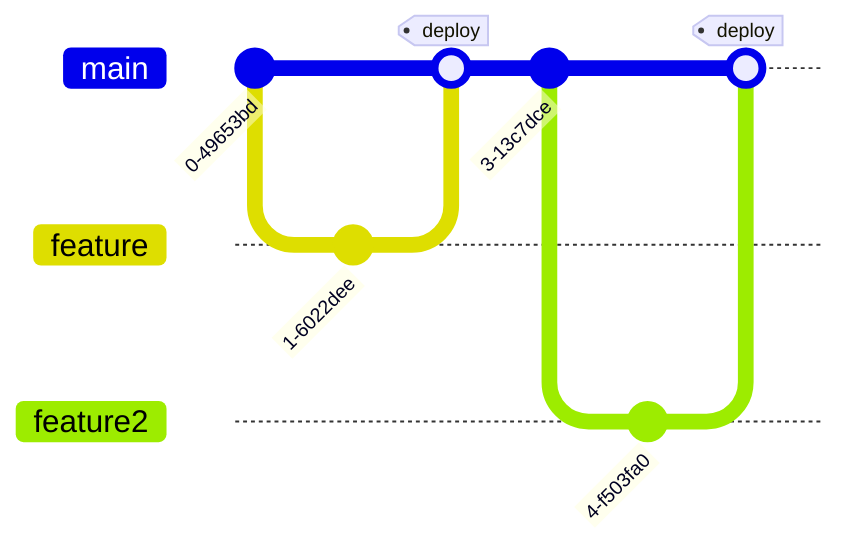

# Production Best Practices

## 1. What Is This?

The discipline that keeps `main` deployable and history trustworthy in a production setting: branch protection, commit signing, a deliberate branching strategy, secret hygiene, consistent merge strategy, atomic commits, hooks, release tagging, and a hotfix procedure.

## 2. Why Is This Needed?

In development, a bad commit is an inconvenience — you revert it and move on. In production, a bad commit can mean downtime, data loss, a security breach, or a compliance violation. These practices exist because production has no undo button that doesn't cost something.

The underlying principles:
- **`main` is always deployable** — if you can't deploy it now, it shouldn't be on `main`.
- **Every change is reviewed** — no direct commits to protected branches.
- **History is an audit trail** — clean, signed, meaningful commits that explain *why*.
- **Secrets never enter the repo** — not even for a moment, not even in a reverted commit.

## 3. Simple Layman Explanation

Production Git is like a bank vault: multiple sign-offs before anything moves (branch protection + review), a tamper-evident log of who did what (signed commits), and a strict rule that you never leave the keys lying around (no secrets in history).

## 4. Technical Explanation

**Branch protection** rules (set on GitHub/GitLab for `main` and `release/*`):

| Rule | Why |
|------|-----|
| Require PR before merging | No one pushes directly to `main` |
| Require N approving reviews | Someone else read the code |
| Dismiss stale reviews on new push | New commits invalidate old approvals |
| Require status checks to pass | CI must be green |
| Require branches up to date | No merging behind-HEAD branches |
| Restrict force pushes / deletions | No history rewrites or accidental deletes |

**Commit signing** makes authorship cryptographically verifiable — the name/email in a commit are otherwise self-reported and trivially forged.

## 5. Real-World Example — Hotfix from a tag



Branch from the exact released **tag**, not `main` — `main` may already contain unreleased work, and you want to ship *only* the fix.

## 6. Diagram — Branching strategies

**Trunk-based** (recommended for CI/CD): one long-lived `main`, short-lived feature branches, releases via tags, incomplete work behind feature flags.



**Gitflow** (scheduled releases): `main` holds only tagged releases; `develop` integrates; `feature/*`, `release/*`, `hotfix/*` have defined roles.

## 7. Commands

```bash
# --- Commit signing (SSH — simpler, recommended) ---
git config --global gpg.format ssh
git config --global user.signingKey ~/.ssh/id_ed25519.pub
git config --global commit.gpgsign true
git config --global tag.gpgsign true
git log --show-signature -1              # verify a commit
git tag -v v1.0.0                        # verify a tag

# --- Never commit secrets ---
# .gitignore: .env  .env.*  !.env.example  *.pem  *.key  *_rsa  secrets/
gitleaks protect --staged                # scan staged changes
gitleaks detect                          # scan full history
# If a secret was committed: rotate it, then scrub history:
git filter-repo --path secrets.json --invert-paths
git push --force-with-lease origin --all
git push --force-with-lease origin --tags

# --- Merge strategy for PRs (pick one, enforce it) ---
git switch main && git merge --squash feature/login && git commit -m "feat: add login (#42)"  # squash
git switch feature/login && git rebase main && git switch main && git merge --ff-only feature/login  # rebase

# --- Atomic commits: one concern each ---
git commit -m "fix: prevent null pointer in login when session expires"
git commit -m "chore: bump express to 4.18.3"

# --- Pre-commit hooks (via the pre-commit framework) ---
pip install pre-commit
pre-commit install
pre-commit run --all-files

# --- Release tagging ---
git switch main && git pull origin main
git tag -s v2.1.0 -m "Release v2.1.0"
git push origin v2.1.0                   # triggers the release pipeline

# --- Hotfix procedure ---
git switch -c hotfix/v2.1.1 v2.1.0       # branch from the TAG, not main
git commit -m "fix: prevent SQL injection in user search"
git tag -s v2.1.1 -m "Hotfix: SQL injection in user search"
git push origin hotfix/v2.1.1 && git push origin v2.1.1
git switch main && git merge --no-ff hotfix/v2.1.1 && git push origin main
git switch develop && git merge --no-ff hotfix/v2.1.1 && git push origin develop

# --- Audit & compliance ---
git log --show-signature --pretty=format:"%H %G? %aN %aI %s" main   # signed log
git log --merges --first-parent main --oneline                       # release history
```

## 8. Command Explanation

- Signing config (`gpg.format ssh` + `commit.gpgsign true`) signs every commit/tag so they show as "verified".
- `gitleaks`/`git filter-repo` detect and scrub secrets; a force-push (coordinated) rewrites the shared history.
- Squash vs rebase-merge decide how PR commits land on `main` — enforce one via branch protection.
- The hotfix flow branches from the production *tag*, ships a minimal fix, then merges back into `main` and `develop`.

## 9. Practice Tasks

1. Enable SSH commit signing and make a signed commit; verify with `git log --show-signature -1`.
2. Add a `.gitignore` covering `.env` and `*.key`, and run a `gitleaks detect`.
3. Cut an annotated, signed release tag and push it.

## 10. Common Mistakes

- Trusting `revert` to remove a secret — it stays in history and in clones/forks.
- Branching a hotfix from `main` (with unreleased work) instead of the release tag.
- Mixing unrelated changes into one commit, making `bisect`/`revert`/review harder.

## 11. Troubleshooting

- Commits show "unverified" on GitHub → upload your signing key and enable Vigilant mode.
- Secret leaked → rotate it *now*, then scrub with `git filter-repo` and force-push; tell the team to re-clone.
- CI blocks a merge → the branch likely isn't up to date or a check is red; rebase and re-run.

## 12. Best Practices

- `main` always deployable; every change reviewed and signed.
- Prevent secrets with `.gitignore` + pre-commit scanning; never rely on revert.
- Tie every deploy to an annotated, signed tag for rollback and audit.
- Keep commits atomic — each one revertible without breaking unrelated things.

## 13. Quick Recap

- Protect branches; require review + green CI.
- Sign commits/tags for a verifiable audit trail.
- Tag releases; hotfix from tags; secrets never enter history.

## 14. References

- [GitHub Docs — About protected branches](https://docs.github.com/en/repositories/configuring-branches-and-merges-in-your-repository/managing-protected-branches/about-protected-branches)
- [GitHub Docs — Signing commits](https://docs.github.com/en/authentication/managing-commit-signature-verification/signing-commits)
- [Trunk-Based Development](https://trunkbaseddevelopment.com/) · [A successful Git branching model (Gitflow)](https://nvie.com/posts/a-successful-git-branching-model/)
- [git-filter-repo](https://github.com/newren/git-filter-repo) · [gitleaks](https://github.com/gitleaks/gitleaks) · [pre-commit](https://pre-commit.com/)

<!-- NAV-FOOTER -->

---

### 🧭 Navigation

| Previous | Up | Next |
|:---|:---:|---:|
| ⬅️ Prev: [Module 13 — Production Best Practices](README.md) | ⬆️ Module: [Module 13 — Production Best Practices](README.md) | ➡️ Next: [Diagrams](../diagrams/README.md) |
