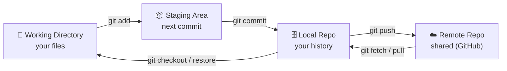
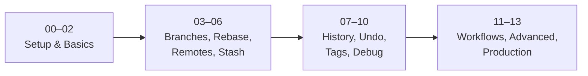

# Git Cheat Sheet

A practical, structured Git reference that reads like a course — from installing Git to running it safely in production. Every topic follows the same teaching template (what it is, why it matters, a plain-English analogy, the technical detail, a real-world example, a diagram, the commands, practice tasks, common mistakes, troubleshooting, and best practices), so you can learn linearly or jump straight to a command.

Diagrams throughout are written in [Mermaid](https://mermaid.js.org/) and render automatically on GitHub.

---

## Who This Is For

- **Beginners** who want to understand Git, not just memorize commands.
- **Working developers** who need a fast, reliable reference for day-to-day tasks.
- **Teams** standardizing on branching strategies, signing, and release practices.

No prior Git knowledge is assumed for Module 00; each module builds on the previous one.

---

## The Big Picture

If you remember one diagram about Git, make it this one. Every command moves your work between these four places:



**The mental model:** you *edit* files (Working Directory), *choose* what to save (Staging Area), *save* it permanently (Local Repo), and *share* it with your team (Remote Repo).

---

## Learning Path



---

## Modules

| # | Module | What's Inside |
|---|--------|---------------|
| 00 | [Installation](00-installation/) | Windows & Linux install methods, verifying the install |
| 01 | [Configuration](01-configuration/) | User setup, editor, credentials, aliases |
| 02 | [Basics](02-basics/) | init, clone, status, stage, commit; the three trees |
| 03 | [Branching & Merging](03-branching-and-merging/) | branches, fast-forward vs `--no-ff`, conflict resolution |
| 04 | [Rebasing](04-rebasing/) | basic rebase, interactive rebase, squashing |
| 05 | [Remote Operations](05-remote-operations/) | fetch, pull, push, tracking branches, force-push |
| 06 | [Stashing](06-stashing/) | stash, pop, apply, list, drop |
| 07 | [History & Diffing](07-history-and-diffing/) | log filters, diff, blame, show |
| 08 | [Undoing Changes](08-undoing-changes/) | restore, reset, revert, reflog |
| 09 | [Tags](09-tags/) | lightweight & annotated tags, push, delete |
| 10 | [Debugging](10-debugging/) | bisect, blame, log -S, log -L |
| 11 | [Collaboration Workflows](11-workflows/) | fork/PR flow, feature-branch flow |
| 12 | [Advanced](12-advanced/) | cherry-pick, worktrees, submodules, LFS, one-liners |
| 13 | [Production Best Practices](13-production/) | branch protection, signing, secrets, hotfix, release tagging |
| — | [Diagrams](diagrams/) | Every Mermaid diagram in one visual reference |
| — | [References](references/) | Official docs, standards, per-module reading list, learning resources |

---

## Quick Reference

| Task | Command |
|------|---------|
| Init repo | `git init` |
| Clone | `git clone <url>` |
| Stage all | `git add .` |
| Commit | `git commit -m "msg"` |
| Push | `git push origin <branch>` |
| Pull | `git pull origin <branch>` |
| New branch | `git switch -c <name>` |
| Switch branch | `git switch <name>` |
| Merge | `git merge <branch>` |
| Rebase onto main | `git rebase main` |
| Stash changes | `git stash push -m "msg"` |
| Pop stash | `git stash pop` |
| Undo last commit | `git reset --soft HEAD~1` |
| Discard file changes | `git restore <file>` |
| View graph log | `git log --oneline --graph --all` |
| Diff staged changes | `git diff --staged` |
| Create release tag | `git tag -a v1.0.0 -m "msg"` |
| Find bad commit | `git bisect start` |
| Recover lost work | `git reflog` |

---

## How to Use This Repo

- **Learning from scratch?** Start at [Module 00](00-installation/) and follow the Next links in each nav footer.
- **Need a specific command?** Jump to the module in the table above; each topic file's **Commands** section is copy-paste ready.
- **Want the visuals?** See [Diagrams](diagrams/) for every Mermaid diagram collected in one place.
- **Going deeper?** The [References](references/) section links the official docs and a per-module reading list.

Each module folder contains a `README.md` (overview, learning flow, practice, revision) and a topic file with the full 14-section breakdown.

---

## Contributing

- All content is Markdown; code blocks use the ` ```bash ` language tag.
- Keep each topic file self-contained and follow the 14-section template.
- Add new commands to the appropriate existing module; new major topics get a new numbered module folder + a row in the table above.
- Update the nav footers (Prev / Up / Next) when adding or reordering modules.

---

## References

- [Pro Git Book (free)](https://git-scm.com/book/en/v2) · [Git Official Docs](https://git-scm.com/doc)
- [Conventional Commits](https://www.conventionalcommits.org/) · [Semantic Versioning](https://semver.org/)
- [Learn Git Branching](https://learngitbranching.js.org/) (interactive)
- Full list in [references/](references/).

<!-- NAV-FOOTER -->

---

### 🧭 Navigation

| Previous | Up | Next |
|:---|:---:|---:|
| ⬅️ Prev: — | ⬆️ Home: [Git Cheat Sheet](README.md) | ➡️ Next: [Module 00 — Installation](00-installation/README.md) |
