# Mermaid Diagrams — Visual Reference

Every key diagram from the modules, collected in one place. Each renders automatically on GitHub; edit them in the [Mermaid Live Editor](https://mermaid.live/).

---

## Module 02 — Basics

### The Four Areas

The one diagram to remember: every command moves work between these four places.

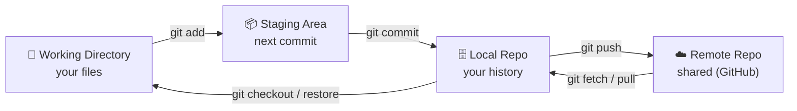

### The Three Trees

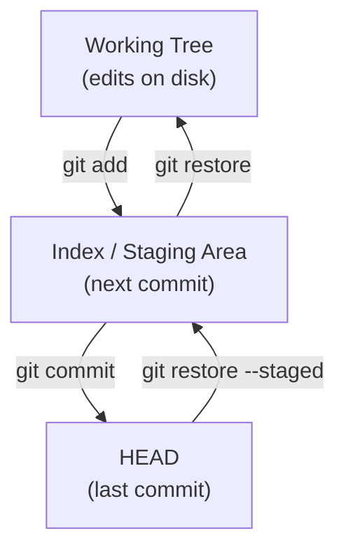

---

## Module 03 — Branching & Merging

### A Branch Is Just a Pointer

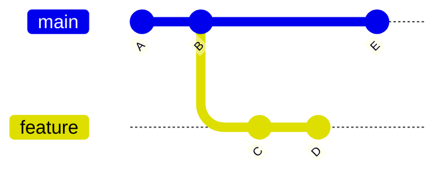

### Fast-Forward vs `--no-ff`

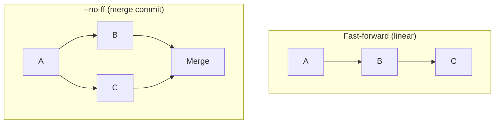

### Merge-Conflict Flow

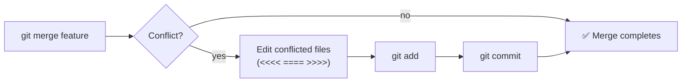

---

## Module 04 — Rebasing

### Before / After a Rebase

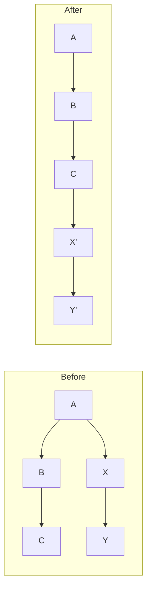

### Merge vs Rebase

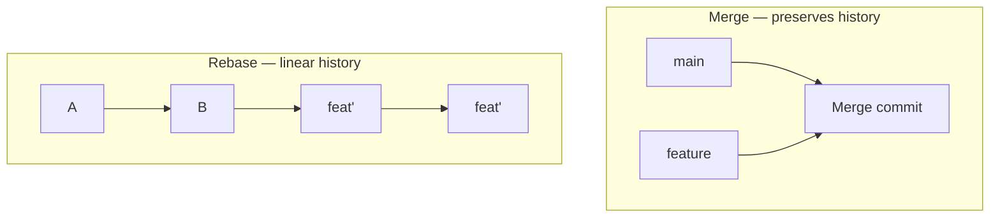

---

## Module 05 — Remote Operations

### Remote Data Flow

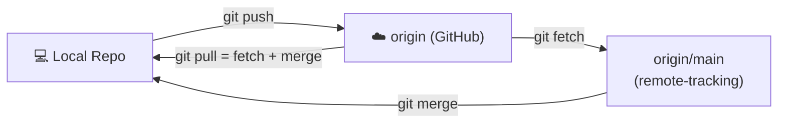

### `origin/main` — A Local Snapshot of the Remote

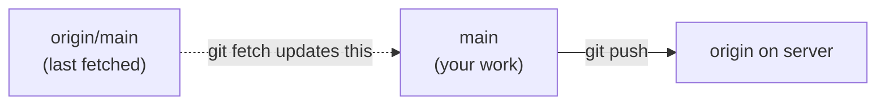

---

## Module 06 — Stashing

### Stash Flow

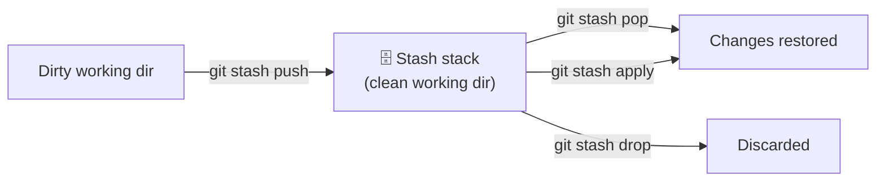

---

## Module 07 — History & Diffing

### Walking the Commit Graph

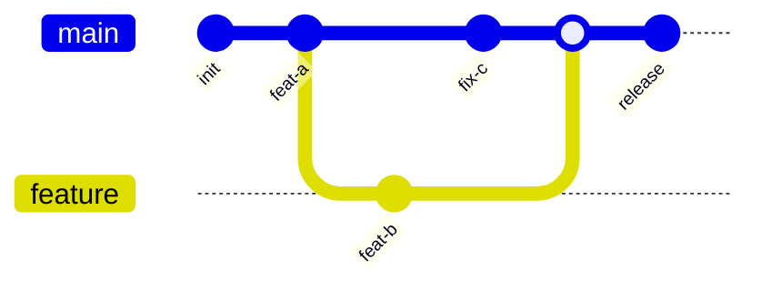

---

## Module 08 — Undoing Changes

### Reset Modes

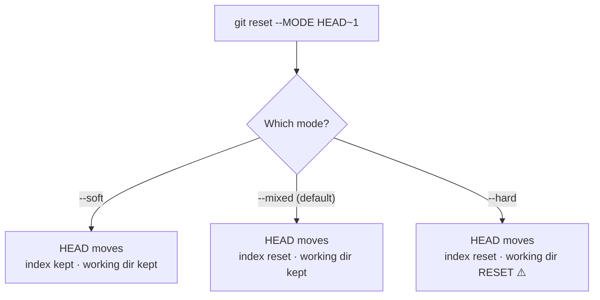

### Revert vs Reset

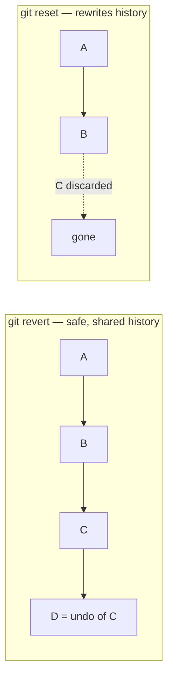

---

## Module 09 — Tags

### Tag Timeline

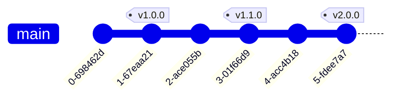

---

## Module 10 — Debugging

### Bisect — Binary Search for a Bad Commit

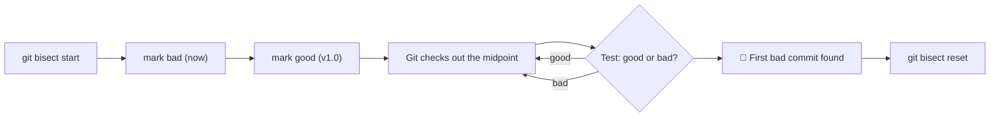

---

## Module 11 — Collaboration Workflows

### Fork & Pull Request

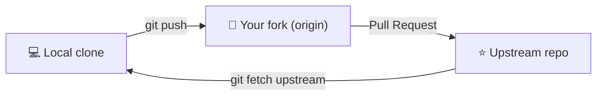

### Feature-Branch Flow

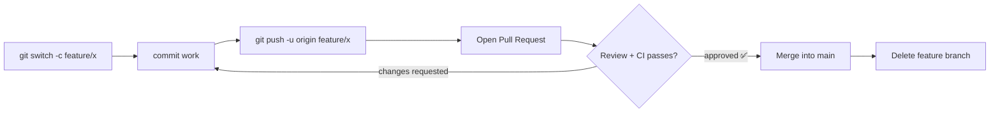

---

## Module 12 — Advanced

### cherry-pick

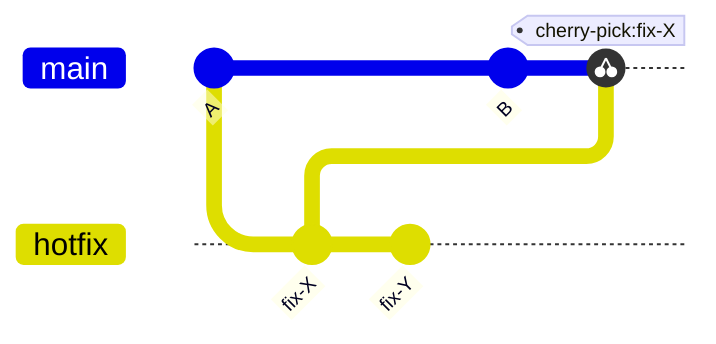

### Worktrees — One `.git`, Many Working Dirs

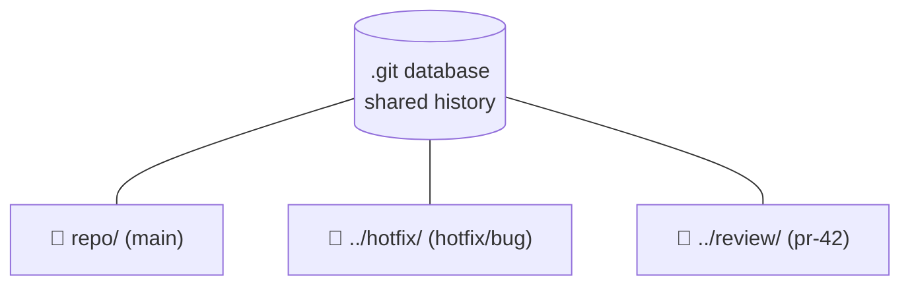

### Git LFS

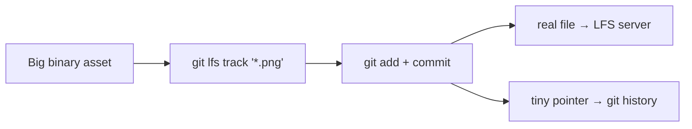

---

## Module 13 — Production

### Hotfix from a Tag

```mermaid
flowchart TD
    A["🔥 Bug in prod (v2.1.0)"] --> B["Branch from the TAG<br/>git switch -c hotfix/v2.1.1 v2.1.0"]
    B --> C["Apply minimal fix + commit"]
    C --> D["Tag v2.1.1 & push → deploy"]
    D --> E["Merge fix into main"]
    E --> F["Merge fix into develop/trunk"]
```

### Trunk-Based Strategy

```mermaid
gitGraph
    commit
    branch feature
    checkout feature
    commit
    checkout main
    merge feature tag: "deploy"
    commit
    branch feature2
    checkout feature2
    commit
    checkout main
    merge feature2 tag: "deploy"
```

<!-- NAV-FOOTER -->

---

### 🧭 Navigation

| Previous | Up | Next |
|:---|:---:|---:|
| ⬅️ Prev: [Diagrams](README.md) | ⬆️ Home: [Git Cheat Sheet](../README.md) | ➡️ Next: [References](../references/README.md) |
