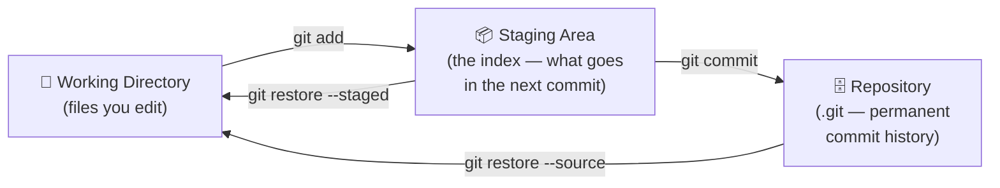
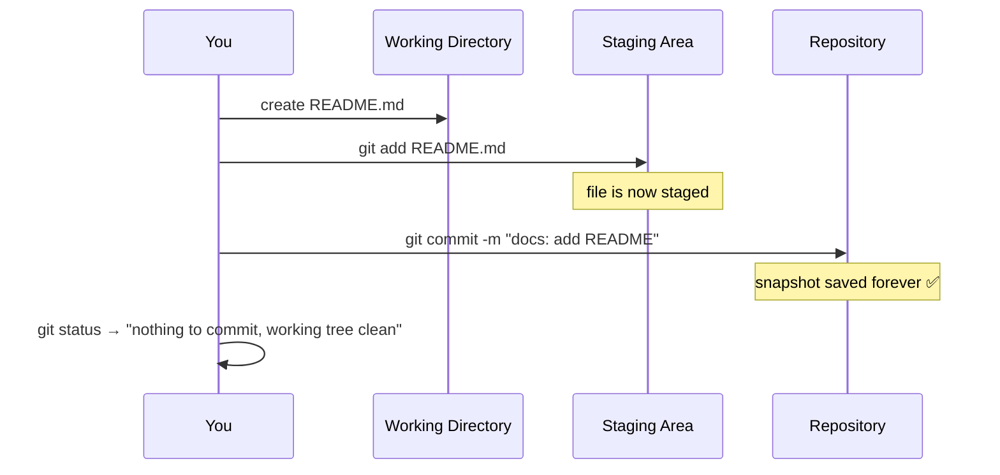
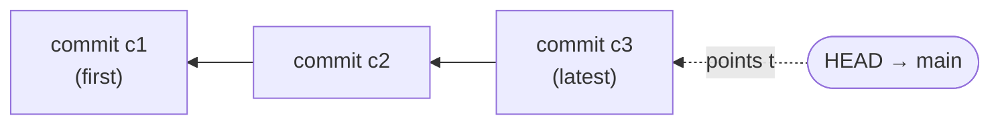

# Basics

## Why Git?

Every software project changes over time. Without version control, you're left with manual backups (`auth_v2_final_FINAL.js`), no way to trace who changed what or why, and no safe way to experiment. Git solves this by recording every change as a **commit** — a permanent, addressable snapshot of your project at a point in time.

> **Real-world analogy:** Think of Git like the *save points* in a video game. Every commit is a save point you can return to. If you mess up, you reload the last good save instead of starting the whole game over.

Key reasons Git is the standard:

- **History** — every change is recorded, attributable, and reversible.
- **Collaboration** — multiple developers can work on the same codebase without overwriting each other.
- **Branching** — you can experiment or develop features in complete isolation, then merge when ready.
- **Distributed** — every developer has a full copy of the repo; there's no single point of failure.

## The Three Areas of Git

Almost everything in Git is about moving your files between **three areas**. Understanding this picture makes every command click into place:



- **Working Directory** — the actual files on your disk that you're editing right now.
- **Staging Area** — a "loading dock" where you place exactly the changes you want in your next commit.
- **Repository** — the permanent, recorded history once you commit.

> **Real-world analogy:** Staging is like an **online shopping cart**. You browse the whole store (working directory), add only the items you actually want to the cart (`git add`), then check out (`git commit`). You don't have to buy everything in the store just because you looked at it.

## Why Stage Changes Separately?

Most version control systems commit the entire working directory at once. Git's **staging area** (the index) sits between your working directory and the commit. This lets you:

- Bundle only related changes into one commit, even if your working directory has unrelated edits in progress.
- Review exactly what you're about to commit before it becomes permanent.
- Split a messy session of edits into clean, logical commits that are easy to review and bisect.

**Example:** You fixed a bug in `login.js` *and* started experimenting in `dashboard.js`. You can stage only `login.js`, commit "fix: login bug", and leave the half-finished dashboard work uncommitted for later.

---

Core everyday commands: creating repos, checking status, staging, and committing.

---

## Repository Setup

```bash
# Initialize a new repo in the current directory
git init

# Initialize in a new directory
git init my-project

# Clone a remote repo into a new folder
git clone https://github.com/user/repo.git

# Clone into a custom-named folder
git clone https://github.com/user/repo.git my-folder

# Shallow clone — only latest snapshot, no full history (faster for CI)
git clone --depth 1 https://github.com/user/repo.git

# Clone a specific branch
git clone --branch develop https://github.com/user/repo.git
```

---

## Checking Status

```bash
# Show which files are staged, unstaged, or untracked
git status

# Compact output — one line per file
git status -s
# M  staged modification
#  M unstaged modification
# ?? untracked file
# A  newly staged file
```

---

## Staging

The staging area (index) lets you craft commits precisely — stage only what belongs together.

```bash
# Stage a specific file
git add file.txt

# Stage an entire directory
git add src/

# Stage everything in the current directory
git add .

# Interactively choose which chunks to stage (patch mode)
# Git shows each diff hunk — press y to stage, n to skip
git add -p

# Unstage a file (changes remain in working directory)
git restore --staged file.txt
```

---

## Committing

```bash
# Commit everything that's staged
git commit -m "feat: add login page"

# Stage all tracked files and commit in one step (skips new/untracked files)
git commit -am "fix: correct null check"

# Open editor to write a multi-line commit message
git commit

# Amend the last commit — fix the message
git commit --amend -m "fix: corrected message"

# Amend the last commit — add a forgotten file, keep the message
git add forgotten.txt
git commit --amend --no-edit

# Create an empty commit (useful to re-trigger CI pipelines)
git commit --allow-empty -m "chore: trigger pipeline"
```

> Amending rewrites history. Only amend commits that haven't been pushed to a shared branch.

---

## Commit Message Convention

A widely used format is [Conventional Commits](https://www.conventionalcommits.org/):

```
<type>: <short summary>

[optional body]
[optional footer]
```

Common types: `feat`, `fix`, `chore`, `docs`, `refactor`, `test`, `style`, `ci`

**Examples:**
```
feat: add password reset flow
fix: prevent crash when user list is empty
chore: bump dependency versions
docs: update API authentication guide
```

---

## Putting It Together: A Typical First Commit



---

## What Is a Commit, Really?

A commit is **not** a list of changes (a "diff"). It's a complete **snapshot** of your entire project at one moment — like a photograph of all your files. (Git is smart about storage: unchanged files aren't duplicated, they're reused. But mentally, picture a full snapshot.)

Every commit has three parts:

1. **A snapshot** of all tracked files at that moment.
2. **A unique ID** — a 40-character SHA-1 hash like `a1b2c3d4...`. This is the commit's fingerprint; even a one-character change produces a totally different ID.
3. **A link to its parent** — the commit that came before it. This is what chains commits into a history.



> **Real-world analogy:** Each commit is a numbered photo in an album. Every photo "remembers" the one taken before it, so you can always flip backward through the whole story.

**HEAD** is simply "where you are right now" — a pointer to the commit you currently have checked out (usually the tip of your current branch). When you make a new commit, HEAD moves forward to it.

**Why the hash matters:** Because the ID is derived from the content *and* the parent, you can't secretly alter an old commit. Changing anything changes its hash — and every commit after it — which is exactly why Git history is trustworthy and tamper-evident.

```bash
# See the hash, author, and message of recent commits
git log --oneline -3
# a1b2c3d feat: add login page   ← short form of the 40-char hash
# 9f8e7d6 docs: add README
# 1122334 chore: initial commit

# Where is HEAD pointing right now?
git rev-parse HEAD        # full hash of the current commit
git branch --show-current # the branch HEAD is on
```

> 📖 **Go deeper:** [Pro Git — Git Internals: Git Objects](https://git-scm.com/book/en/v2/Git-Internals-Git-Objects) explains the blob/tree/commit model behind snapshots.

---

## References

- [Pro Git — Recording Changes to the Repository](https://git-scm.com/book/en/v2/Git-Basics-Recording-Changes-to-the-Repository)
- [Pro Git — Getting a Git Repository](https://git-scm.com/book/en/v2/Git-Basics-Getting-a-Git-Repository)
- [git add — official docs](https://git-scm.com/docs/git-add)
- [git commit — official docs](https://git-scm.com/docs/git-commit)
- [Conventional Commits specification](https://www.conventionalcommits.org/en/v1.0.0/)
