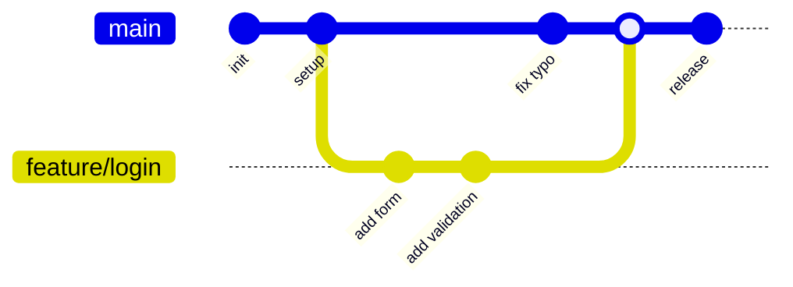
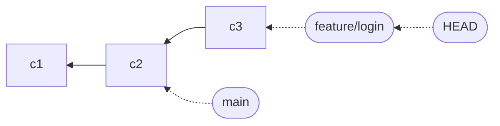
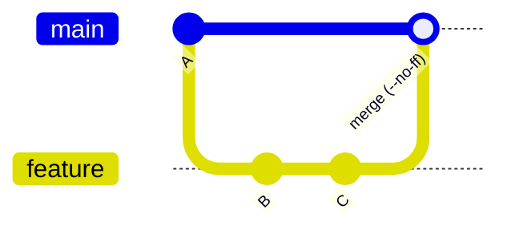
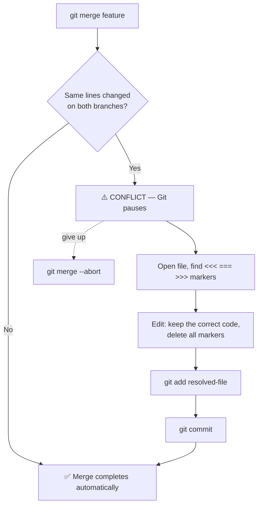

# Branching & Merging

## Why Branches?

In a shared codebase, `main` (or `master`) should always be in a working, deployable state. If everyone committed directly to `main`, any in-progress feature or broken experiment would immediately break the project for the whole team.

Branches solve this by giving each developer (or each feature/fix) a **separate line of development**. Work happens in isolation, and changes are only merged back when they're complete and reviewed. This enables:

- **Parallel development** — multiple features in flight simultaneously without conflict.
- **Safe experimentation** — try a new approach on a branch; if it fails, delete the branch and nothing is lost.
- **Code review** — open a Pull Request from a branch, get feedback, then merge — keeping history clean and intentional.
- **Release management** — maintain stable `release/x.x` branches while `main` continues forward.

> **Real-world analogy:** A branch is like writing a draft of an essay in a **separate copy** of the document. You can rewrite it freely; the original stays untouched until you're happy and paste your changes back in.

Here's what a feature branch looks like — it splits off `main`, gets its own commits, then merges back:



## Why Merge?

Once work on a branch is complete, it needs to be brought back into the shared history. Merging creates a point in history where two lines of development come together. The **merge commit** is explicit evidence that the feature was reviewed and integrated, making it easy to audit or revert an entire feature in one step with `git revert <merge-commit>`.

## What Is a Branch, Really?

This is the idea that makes branching "click": **a branch is just a lightweight, movable pointer to a commit.** That's it. The branch named `main` is literally a tiny file containing one commit hash.

Because a branch is only a pointer (about 40 bytes on disk), creating one is **instant and free** — Git copies nothing. Compare that to the old way of "branching" by duplicating an entire folder.



- Each commit still links to its parent (the chain).
- `main` and `feature/login` are just two pointers sitting on different commits.
- **HEAD** points to the branch you're currently on. `git switch` simply moves HEAD to a different branch.
- When you commit, the *current branch pointer* moves forward to the new commit — the others stay put.

> **Real-world analogy:** Think of commits as a row of houses on a street, and a branch as a **name sign** you can pick up and plant in front of any house. Switching branches just means walking to a different sign. Making a commit builds a new house and moves your sign onto it.

```bash
# A branch really is just a file holding a commit hash — see for yourself:
cat .git/refs/heads/main     # prints the 40-char commit hash main points to
git rev-parse main           # same thing, the clean way
```

> 📖 **Go deeper:** [Pro Git — Branches in a Nutshell](https://git-scm.com/book/en/v2/Git-Branching-Branches-in-a-Nutshell) walks through this pointer model with diagrams.

---

Branches let you work on features or fixes in isolation without affecting the main codebase.

---

## Branching

```bash
# List local branches (* marks the current branch)
git branch

# List remote branches
git branch -r

# List all branches (local + remote)
git branch -a

# Create a branch (stays on current branch)
git branch feature/login

# Switch to an existing branch
git switch feature/login
git checkout feature/login    # older syntax

# Create and switch in one step
git switch -c feature/signup
git checkout -b feature/signup  # older syntax

# Rename a branch
git branch -m old-name new-name
git branch -m new-name          # rename the current branch

# Delete a branch (only if fully merged)
git branch -d feature/login

# Force-delete an unmerged branch
git branch -D feature/login

# Delete a remote branch
git push origin --delete feature/login

# Track a remote branch locally
git switch --track origin/feature/login
```

---

## Merging

Merging integrates changes from one branch into another. Always merge into the branch you want to update.

```bash
# Switch to the target branch first
git switch main

# Merge a feature branch into main
git merge feature/login

# Merge with a merge commit even if fast-forward is possible
# Creates an explicit merge commit, preserving branch history
git merge --no-ff feature/login

# Squash all commits from the branch into one staged change (then commit manually)
git merge --squash feature/login
git commit -m "feat: add login feature"

# Abort a merge that's in progress
git merge --abort
```

### Fast-forward vs No-fast-forward

A **fast-forward** merge happens when `main` hasn't changed since you branched off — Git just slides the `main` pointer forward. With `--no-ff`, Git always creates a dedicated merge commit so the branch's existence stays visible in history.



| | Fast-forward | `--no-ff` |
|---|---|---|
| History | Linear — looks like commits were on main all along | Preserves branch topology |
| Merge commit | No | Yes |
| Best for | Short-lived / solo branches | Team branches, features |

> **Tip:** Many teams use `--no-ff` for feature branches so each feature shows up as one clear bubble in the history — and can be reverted in one step with `git revert -m 1 <merge-commit>`.

---

## Resolving Merge Conflicts

Conflicts happen when two branches changed the same lines differently. Git pauses and asks you to decide.

> **Real-world analogy:** Two editors rewrote the *same sentence* of a shared document differently. The document tool can't know which version is right, so it shows you both and asks you to pick — that's a merge conflict.



**Step-by-step:**

```bash
# 1. Attempt the merge
git merge feature/login
# CONFLICT (content): Merge conflict in src/auth.js

# 2. Open the conflicted file — Git marks the conflict zones:
# <<<<<<< HEAD
# your changes on main
# =======
# their changes from feature/login
# >>>>>>> feature/login

# 3. Edit the file — keep what's correct, remove all markers

# 4. Stage the resolved file
git add src/auth.js

# 5. Commit to complete the merge
git commit
# (Git pre-fills the merge commit message)

# --- OR, if you want to give up ---
git merge --abort
```

**Tips:**
- Use `git status` during a conflict to see which files still need resolution.
- VS Code, IntelliJ, and most editors have built-in merge conflict UI.
- `git diff` during a conflict shows the unresolved sections.

---

## References

- [Pro Git — Branches in a Nutshell](https://git-scm.com/book/en/v2/Git-Branching-Branches-in-a-Nutshell)
- [Pro Git — Basic Branching and Merging](https://git-scm.com/book/en/v2/Git-Branching-Basic-Branching-and-Merging)
- [git branch](https://git-scm.com/docs/git-branch) · [git switch](https://git-scm.com/docs/git-switch) · [git merge](https://git-scm.com/docs/git-merge)
- [Learn Git Branching — interactive visual tutorial](https://learngitbranching.js.org/)
- [GitHub Docs — Resolving a merge conflict](https://docs.github.com/en/pull-requests/collaborating-with-pull-requests/addressing-merge-conflicts/resolving-a-merge-conflict-using-the-command-line)
