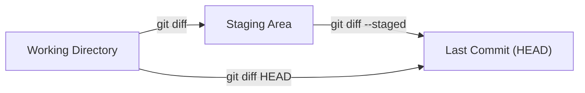

# History & Diffing

## Why Inspect History?

Every commit in Git is a permanent, queryable record — not just of *what* changed, but of *when*, *who*, and (with good commit messages) *why*. Being able to interrogate this history is one of Git's most powerful features and separates it from just having backups.

Practical reasons to dig into history:
- **Understand a decision** — why was this code written this way? `git log -p` and `git blame` answer this without having to find the author.
- **Audit changes** — what changed between the last two releases? `git log v1.1.0..v1.2.0` tells you in seconds.
- **Find regressions** — a feature worked last week; `git log -S "functionName"` finds the commit that changed it.
- **Onboard faster** — reading the history of a file tells you more about its intent than reading the code alone.

`git diff` complements `git log` by showing the *content* of changes rather than just their metadata — letting you compare branches, commits, or your staged vs. unstaged work at any point.

---

Explore what changed, when, by whom, and why.

---

## How to Point at Any Commit

Before filtering history, you need a way to *name* commits. You rarely type full 40-character hashes — Git gives you shorthand that works in almost every command (`log`, `diff`, `show`, `reset`, `rebase`, …).

| Reference | Means |
|-----------|-------|
| `HEAD` | The commit you're currently on |
| `HEAD~1` or `HEAD~` | One commit **back** (the parent) |
| `HEAD~3` | Three commits back |
| `HEAD^` | The parent (same as `HEAD~1` for normal commits) |
| `HEAD^2` | The **second** parent — only meaningful on a merge commit |
| `a1b2c3d` | A specific commit by its (short) hash |
| `main`, `v1.2.0` | The commit a branch or tag points to |


> **Real-world analogy:** `HEAD~2` is like saying "two pages back from where my bookmark is" — you don't need the page number, just count backward from where you are.

### Selecting a *range* of commits: `..` vs `...`

This trips up almost everyone. The difference matters constantly:

- `A..B` → commits reachable from **B but not A**. Read it as *"what's in B that isn't in A yet."*
- `A...B` → commits in **either** branch but **not both** (the symmetric difference).

```bash
# "What's on the remote that I don't have locally?"
git log main..origin/main --oneline

# "What have I done on my branch that isn't on main yet?"
git log main..HEAD --oneline

# "Where did these two branches diverge?" (everything unique to either side)
git log main...feature/login --oneline --left-right
```

> 📖 **Go deeper:** [Pro Git — Revision Selection](https://git-scm.com/book/en/v2/Git-Tools-Revision-Selection) covers every way to name commits and ranges.

---

## git log

```bash
# Full log (newest first)
git log

# One commit per line
git log --oneline

# Branch graph — shows how branches diverge and merge
git log --oneline --graph --decorate --all

# Last N commits
git log -5

# Show what changed in each commit (full patch)
git log -p

# Show change statistics per commit
git log --stat

# Compact stats — just filenames and change counts
git log --shortstat
```

### Filtering the Log

```bash
# By author (partial match works)
git log --author="Prakhar"

# By date range
git log --since="2024-01-01" --until="2024-12-31"
git log --since="2 weeks ago"

# By commit message keyword
git log --grep="authentication"

# By content — commits that added or removed a string
git log -S "getUserById"

# By file — only commits that touched a specific file
git log -- src/auth.js

# Follow a renamed file through history
git log --follow -- src/old-name.js

# Commits in branch-a that aren't in branch-b
git log main..feature/login --oneline

# Commits reachable from either branch but not both
git log main...feature/login --oneline --left-right
```

---

## git show

Inspect a specific commit or object.

```bash
# Show the most recent commit
git show HEAD

# Show a specific commit
git show a1b2c3

# Show a commit 2 steps before HEAD
git show HEAD~2

# Show only the changed files, not the full diff
git show --stat HEAD

# Show a specific file as it was at a commit
git show a1b2c3:src/auth.js
```

---

## git diff

**What does `git diff` compare?** The plain command and `--staged` look at *different pairs* of areas. This trips up beginners constantly:



- `git diff` → "what have I changed but **not staged** yet?"
- `git diff --staged` → "what's **staged** and about to be committed?"
- `git diff HEAD` → "**everything** different from the last commit."

```bash
# Unstaged changes (working directory vs index)
git diff

# Staged changes (index vs last commit)
git diff --staged
git diff --cached    # same thing

# Compare two branches
git diff main feature/login

# Compare two commits
git diff a1b2c3 d4e5f6

# Diff a specific file
git diff HEAD -- src/auth.js

# Show only file names that changed (no diff content)
git diff --name-only main feature/login

# Show files with their change summary
git diff --stat main feature/login
```

---

## git blame

Shows who last changed each line of a file and in which commit. Useful for understanding context or tracking down when a bug was introduced.

```bash
# Annotate every line with author and commit
git blame src/auth.js

# Limit to a specific line range
git blame -L 15,40 src/auth.js

# Ignore whitespace-only changes
git blame -w src/auth.js

# Show commit hash in short form
git blame --abbrev=7 src/auth.js

# Detect lines moved or copied within the file
git blame -M src/auth.js

# Detect lines moved or copied from other files in the same commit
git blame -C src/auth.js
```

**Reading the output:**
```
a1b2c3ef (Prakhar Gupta 2024-03-10 14:22:01 +0530 42) const token = jwt.sign(payload, secret);
^commit   ^author        ^date                    ^line ^content
```

---

## References

- [Pro Git — Viewing the Commit History](https://git-scm.com/book/en/v2/Git-Basics-Viewing-the-Commit-History)
- [git log](https://git-scm.com/docs/git-log) · [git diff](https://git-scm.com/docs/git-diff) · [git show](https://git-scm.com/docs/git-show) · [git blame](https://git-scm.com/docs/git-blame)
- [Understanding `..` vs `...` in Git ranges](https://git-scm.com/book/en/v2/Git-Tools-Revision-Selection#_commit_ranges)
