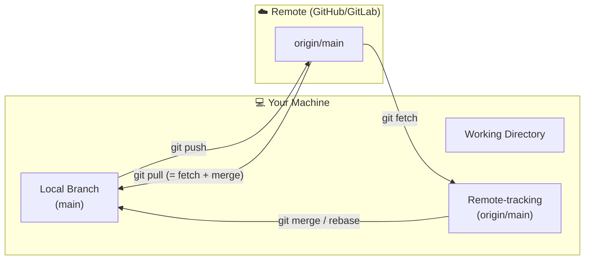
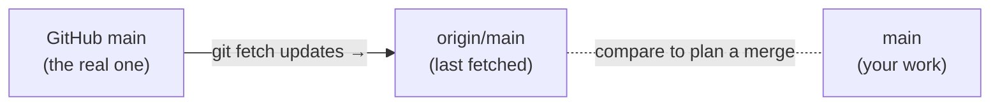

# Remote Operations

## Why Remote Repos?

Git is a **distributed** version control system — every developer has a complete local copy of the repo and can commit, branch, and view history entirely offline. But teams need a shared, authoritative source of truth that everyone can push to and pull from. That shared copy lives on a **remote** (GitHub, GitLab, Bitbucket, or a self-hosted server).

Remotes enable:
- **Collaboration** — teammates push their branches and pull each other's work.
- **Backup** — the remote is an off-machine copy; losing your laptop doesn't lose the project.
- **CI/CD integration** — every push can trigger automated builds, tests, and deployments.
- **Code review** — Pull Requests are opened against a remote, giving a central place for discussion.

## Why Fetch Before Pull?

`git fetch` downloads remote changes into your local repo without touching your working directory or branches. `git pull` = `git fetch` + `git merge` (or rebase). Fetching first lets you **inspect** what changed (`git log HEAD..origin/main`) before deciding how to integrate it — useful when you want `--rebase` instead of a merge commit, or when you just want to check if you're behind before starting work.

## How Code Travels Between You and the Remote



> **Real-world analogy:** The remote is a **shared Google Drive folder** for your team's code. `push` uploads your work, `fetch` downloads the latest *without* changing your local files yet, and `pull` downloads *and* applies it.

## What Is `origin/main`? (Remote-Tracking Branches)

When you see `origin/main`, that's a **remote-tracking branch** — a local, read-only bookmark that records "where `main` was on the remote the last time I talked to it."

The key insight: **`origin/main` only updates when you `fetch` or `pull`.** It is *not* live. If a teammate pushes while you're offline, your `origin/main` is stale until you fetch again.

So at any moment you actually have three pointers in play:

| Pointer | What it is |
|---------|-----------|
| `main` | Your local branch — what *you* have committed |
| `origin/main` | Your last-known snapshot of the remote's `main` |
| (the real remote) | The actual `main` on GitHub — only seen via fetch |



> **Real-world analogy:** `origin/main` is a **photo of the remote** you took last time you synced — useful, but it doesn't change just because the real thing did. Run `git fetch` to take a fresh photo.

```bash
# Refresh your photo of the remote without touching your own work
git fetch origin

# Now safely compare: what did the team add that I don't have?
git log main..origin/main --oneline
```

> 📖 **Go deeper:** [Pro Git — Remote Branches](https://git-scm.com/book/en/v2/Git-Branching-Remote-Branches).

---

Remotes are named references to repositories hosted elsewhere (GitHub, GitLab, Bitbucket, self-hosted). `origin` is the conventional name for the repo you cloned from.

---

## Managing Remotes

```bash
# List remotes with their URLs
git remote -v

# Add a remote
git remote add origin https://github.com/user/repo.git

# Add a second remote (common in fork workflows)
git remote add upstream https://github.com/original/repo.git

# Change a remote's URL (e.g. switching from HTTPS to SSH)
git remote set-url origin git@github.com:user/repo.git

# Rename a remote
git remote rename origin old-origin

# Remove a remote
git remote remove upstream
```

---

## Fetching

Fetch downloads remote changes into your local repo but does **not** modify your working directory or branches. Safe to run at any time.

```bash
# Fetch updates from origin
git fetch origin

# Fetch a specific branch
git fetch origin main

# Fetch from all remotes
git fetch --all

# Fetch and remove local references to deleted remote branches
git fetch --prune
```

After fetching, you can inspect what changed before merging:

```bash
git log HEAD..origin/main --oneline   # commits on remote not yet in local main
git diff HEAD origin/main             # diff between local and remote main
```

---

## Pulling

Pull = fetch + merge (or fetch + rebase with `--rebase`).

```bash
# Fetch and merge remote main into current branch
git pull origin main

# Fetch and rebase instead of merge (keeps history linear)
git pull --rebase origin main

# Pull with fast-forward only — fails if a merge commit would be needed
git pull --ff-only origin main
```

---

## Pushing

```bash
# Push current branch to origin
git push origin feature/login

# Push and set upstream tracking (only needed the first time)
git push -u origin feature/login
# After this, plain `git push` works for this branch

# Push all local branches
git push --all origin

# Push all tags
git push --tags

# Delete a remote branch
git push origin --delete feature/login
```

### Force Pushing

Needed after a rebase or history rewrite. Always prefer `--force-with-lease`.

```bash
# Safe force push — fails if someone else pushed new commits you haven't fetched
git push --force-with-lease origin feature/login

# Unsafe force push — overwrites remote regardless (use only when you're certain)
git push --force origin feature/login
```

---

## Tracking Branches

A tracking relationship lets Git know which remote branch your local branch corresponds to, enabling plain `git push` / `git pull`.

```bash
# Set upstream for the current branch
git branch --set-upstream-to=origin/main main

# Check tracking relationships
git branch -vv
# main   a1b2c3 [origin/main] latest commit message
# feat   d4e5f6 [origin/feat: ahead 2] local work

# ahead N  — you have N commits not yet pushed
# behind N — remote has N commits not yet pulled
```

---

## References

- [Pro Git — Working with Remotes](https://git-scm.com/book/en/v2/Git-Basics-Working-with-Remotes)
- [git fetch](https://git-scm.com/docs/git-fetch) · [git pull](https://git-scm.com/docs/git-pull) · [git push](https://git-scm.com/docs/git-push)
- [GitHub Docs — About remote repositories](https://docs.github.com/en/get-started/git-basics/about-remote-repositories)
- [`--force-with-lease` explained](https://git-scm.com/docs/git-push#Documentation/git-push.txt---no-force-with-lease)
