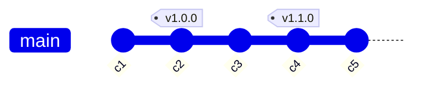

# Tags

## Why Tags?

Branches are **moving** pointers — `main` advances with every commit. You need a way to permanently mark a specific commit as a release milestone so that it's always findable, even after hundreds of subsequent commits.

Tags are **permanent** pointers. Once you tag a commit as `v2.0.0`, that tag always refers to exactly that snapshot, no matter how much `main` moves forward. This is essential for:

- **Reproducible builds** — `git checkout v1.4.2` gives you the exact source that shipped.
- **Release notes** — CI/CD pipelines can trigger deployments when a new tag is pushed, without needing branch logic.
- **Hotfix branching** — if a production bug is reported against `v1.4.2`, you branch from the tag: `git checkout -b hotfix/v1.4.3 v1.4.2`.
- **Auditing** — annotated tags carry a message, tagger identity, and date — a permanent record of who cut the release and when.

Annotated tags are preferred over lightweight tags for releases because they are stored as full Git objects with metadata. Lightweight tags are just a name pointing to a commit with no extra information.

> **Real-world analogy:** A branch is like a **bookmark** that you keep moving as you read further. A tag is like a **sticky note on page 100** — it marks one exact spot forever, no matter how far you read on.



In the graph above, `main` keeps advancing to `c5`, but `v1.0.0` stays pinned to `c2` permanently — so `git checkout v1.0.0` always gives you that exact release.

---

Tags mark specific points in history — most commonly used for release versions (v1.0.0, v2.3.1).

---

## Types of Tags

| Type | Description |
|------|-------------|
| **Lightweight** | A simple pointer to a commit, like a branch that doesn't move |
| **Annotated** | A full Git object with a message, tagger name, date, and optional GPG signature — recommended for releases |

**The difference, simply:** a **lightweight** tag is just a sticky note with a name on it — nothing else. An **annotated** tag is a sticky note *plus* a little card recording who created it, when, and why (and optionally a cryptographic signature proving it's genuine). For anything you ship to users, use annotated tags so the release carries its own paper trail.

```bash
# Lightweight: just a name pointing at a commit
git tag v1.0.0-test

# Annotated: stores tagger, date, message — see the extra metadata with:
git show v1.0.0          # annotated tags show "Tagger:" and the message
```

---

## Creating Tags

```bash
# Lightweight tag on current commit
git tag v1.0.0

# Annotated tag on current commit (recommended)
git tag -a v1.0.0 -m "Release version 1.0.0"

# Tag a past commit
git tag -a v0.9.0 a1b2c3 -m "Beta release"

# GPG-signed tag
git tag -s v1.0.0 -m "Signed release v1.0.0"
```

---

## Listing & Inspecting Tags

```bash
# List all tags
git tag

# Filter tags by pattern
git tag -l "v1.*"

# Show tag details and the tagged commit
git show v1.0.0
```

---

## Pushing Tags

Tags are not pushed automatically with `git push`.

```bash
# Push a specific tag
git push origin v1.0.0

# Push all local tags to remote
git push origin --tags

# Push only annotated tags (skips lightweight)
git push origin --follow-tags
```

---

## Deleting Tags

```bash
# Delete a local tag
git tag -d v1.0.0

# Delete a remote tag
git push origin --delete v1.0.0
# Or the older syntax:
git push origin :refs/tags/v1.0.0
```

---

## Checking Out a Tag

Checking out a tag puts you in **detached HEAD** state — you're not on any branch.

```bash
git checkout v1.0.0
# HEAD is now at a1b2c3... Release version 1.0.0
```

To make changes based on a tag, create a branch from it:

```bash
git checkout -b hotfix/v1.0.1 v1.0.0
```

---

## Versioning Convention

Most projects follow [Semantic Versioning](https://semver.org/): `vMAJOR.MINOR.PATCH`

| Segment | When to increment |
|---------|-------------------|
| MAJOR | Breaking changes |
| MINOR | New features, backwards compatible |
| PATCH | Bug fixes, backwards compatible |

**Example:** `v2.4.1` → fixing a bug makes it `v2.4.2`; adding a feature makes it `v2.5.0`; removing/changing an API makes it `v3.0.0`.

---

## References

- [Pro Git — Tagging](https://git-scm.com/book/en/v2/Git-Basics-Tagging)
- [git tag — official docs](https://git-scm.com/docs/git-tag)
- [Semantic Versioning (SemVer)](https://semver.org/)
- [GitHub Docs — Managing releases](https://docs.github.com/en/repositories/releasing-projects-on-github/managing-releases-in-a-repository)
