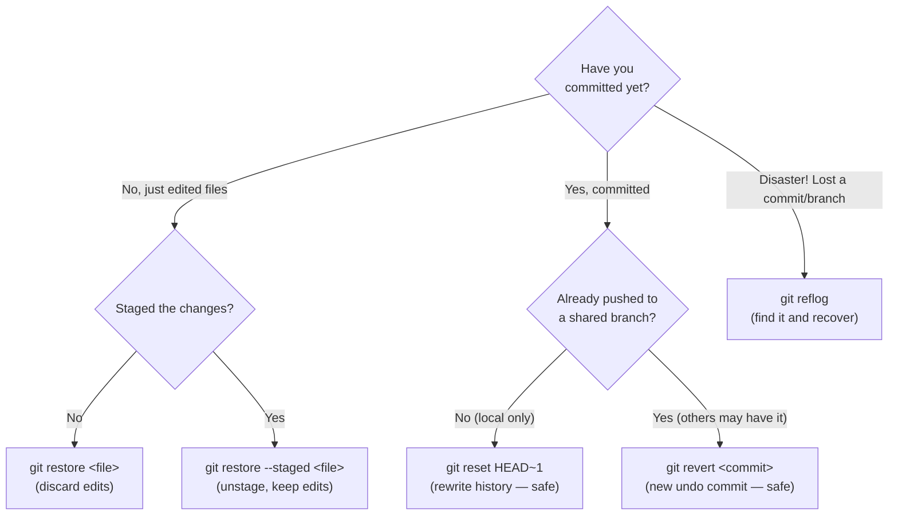
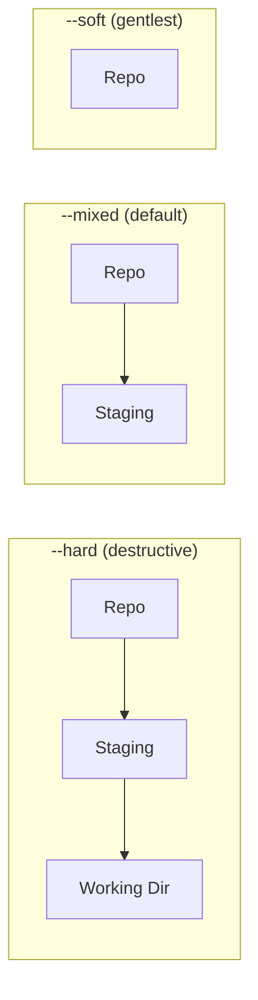

# Undoing Changes

## Why Multiple Undo Tools?

Mistakes happen at different stages of the Git workflow — you might catch an error immediately after typing, or only after pushing to `main`. Git's undo tools are designed for exactly this spectrum:

- **You haven't staged yet** — `git restore` discards the working-directory change.
- **You staged but haven't committed** — `git restore --staged` moves it back to the working directory.
- **You committed locally** — `git reset` moves the branch pointer backward (safe only before pushing).
- **You pushed to a shared branch** — `git revert` creates a new commit that reverses the change, without rewriting history that others may have pulled.
- **You thought everything was lost** — `git reflog` records every HEAD movement as a recovery trail.

The key principle: **rewriting history (`reset`, `rebase`) is only safe before you've shared the commits**. Once commits are on a shared branch, use `revert` to undo safely — it adds to history rather than changing it, so no one else's clone breaks.

## Which Undo Tool Do I Need?

Use this decision tree to pick the right command for your situation:



---

Git gives you several tools to undo work — each with different scope and safety characteristics.

---

## Discard Working Directory Changes

Throws away unstaged changes. **Irreversible** — the changes are gone.

```bash
# Discard changes in a specific file
git restore file.txt

# Discard all unstaged changes in the repo
git restore .

# Restore a file to its state at a specific commit
git restore --source=HEAD~2 src/auth.js
```

---

## Unstage Files

Removes files from the staging area. Changes remain in your working directory.

```bash
# Unstage a specific file
git restore --staged file.txt

# Unstage everything
git restore --staged .
```

---

## git reset — Undo Commits

Moves the branch pointer backward. Use only on **local, unpushed** commits.

**The mental model:** remember the three areas from [Basics](basics.md) — Repository, Staging Area, Working Directory. `reset` moves your branch pointer back, then optionally "rewinds" those areas to match. The mode just decides **how many areas** it rewinds:

- `--soft` → rewinds only the commit. Your changes stay **staged**, ready to re-commit. *(Great for "I committed too early, let me redo the message/commit.")*
- `--mixed` (default) → also unstages. Changes stay in your files but are **unstaged**. *(Great for "uncommit and let me re-pick what to stage.")*
- `--hard` → also wipes your files. Everything is **gone**. *(Use with care — this is the destructive one.)*

> **Real-world analogy:** All three modes hit "undo" on the commit. `--soft` keeps your draft on the desk, `--mixed` puts it back in the drawer, `--hard` throws it in the shredder.

```bash
# --soft: undo commit, keep changes staged
git reset --soft HEAD~1

# --mixed (default): undo commit, keep changes unstaged
git reset --mixed HEAD~1
git reset HEAD~1        # same

# --hard: undo commit and discard all changes (destructive)
git reset --hard HEAD~1

# Reset to a specific commit
git reset --hard a1b2c3
```

| Mode | Commits | Staging area | Working directory |
|------|---------|--------------|-------------------|
| `--soft` | Undone | Changes kept staged | Untouched |
| `--mixed` | Undone | Staged changes unstaged | Untouched |
| `--hard` | Undone | Cleared | Cleared |

**How far back each mode "rewinds":**



Think of it as: `--soft` only undoes the commit, `--mixed` also unstages, `--hard` also wipes your edits. The further right you go, the more you lose — so `--hard` is the one to be careful with.

---

## git revert — Undo Commits Safely

Creates a new commit that reverses the changes of a previous commit. **Safe for shared branches** — it doesn't rewrite history.

**`reset` vs `revert` in one picture:** `reset` *deletes* history by moving the branch pointer back. `revert` *adds* a new commit that cancels out the old one — nothing is erased, so collaborators are never surprised.


```bash
# Revert the most recent commit
git revert HEAD

# Revert a specific commit
git revert a1b2c3

# Revert a range of commits (oldest first)
git revert HEAD~3..HEAD

# Revert without auto-committing (stage the reversal first)
git revert -n a1b2c3
git commit -m "revert: undo broken auth change"
```

> **Rule of thumb:** Use `revert` on `main` or shared branches. Use `reset` only on local feature branches you haven't pushed.

---

## git reflog — Recover Lost Work

Reflog records every movement of HEAD, including resets, rebases, and branch deletions. Your safety net.

```bash
# Show the full reflog
git reflog

# Typical output:
# a1b2c3 HEAD@{0}: commit: feat: add signup
# d4e5f6 HEAD@{1}: reset: moving to HEAD~1
# g7h8i9 HEAD@{2}: commit: feat: add login

# Restore to a previous HEAD position
git reset --hard HEAD@{2}

# Recover a deleted branch
git checkout -b recovered-branch HEAD@{5}

# Show reflog for a specific branch
git reflog show feature/login
```

Reflog entries expire after 90 days (default). Act quickly if you need to recover something.

---

## Typical Undo Scenarios

| Situation | Command |
|-----------|---------|
| Undo last commit, keep work | `git reset --soft HEAD~1` |
| Fix last commit message | `git commit --amend -m "new message"` |
| Add a forgotten file to last commit | `git add file && git commit --amend --no-edit` |
| Discard all local changes | `git restore .` |
| Unstage a file | `git restore --staged file.txt` |
| Undo a pushed commit | `git revert HEAD` |
| Find a lost commit | `git reflog` |

---

## References

- [Pro Git — Undoing Things](https://git-scm.com/book/en/v2/Git-Basics-Undoing-Things)
- [Pro Git — Reset Demystified](https://git-scm.com/book/en/v2/Git-Tools-Reset-Demystified) (deep dive on `--soft`/`--mixed`/`--hard`)
- [git restore](https://git-scm.com/docs/git-restore) · [git reset](https://git-scm.com/docs/git-reset) · [git revert](https://git-scm.com/docs/git-revert) · [git reflog](https://git-scm.com/docs/git-reflog)
- [Atlassian — Undoing Changes](https://www.atlassian.com/git/tutorials/undoing-changes)
