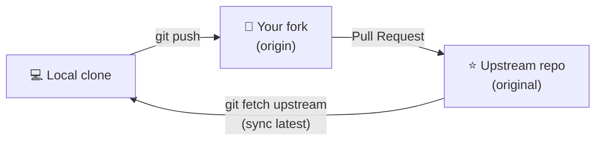
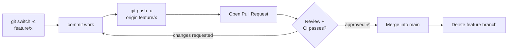

# Collaboration Workflows

## Why Workflows?

Git itself is just a tool — it doesn't enforce how teams use it. Without an agreed workflow, teams end up with commits directly to `main`, broken builds, untested code reaching production, and merge conflicts that take hours to resolve.

A **workflow** is a convention that the whole team follows: which branches exist, how work moves between them, and what gates (code review, CI) must pass before code reaches `main`. The workflow makes the implicit explicit, so everyone knows what to do and what to expect.

**Fork & Pull Request workflow** is designed for open-source and external contributors who don't have write access to the main repo. Changes are proposed from a personal fork and reviewed before being accepted — this protects the upstream repo from untrusted or unreviewed commits.

**Feature Branch workflow** is designed for teams with shared repo access. Every piece of work lives on its own branch and goes through a Pull Request for review before merging — preserving `main` as a stable, always-deployable branch.

Both workflows enforce the same core principle: **`main` is protected, and nothing lands there without review.**

---

Two common Git workflows for working with teams.

---

## Fork & Pull Request Workflow

Used when you don't have direct write access to a repo — common for open source contributions.



> **Real-world analogy:** You can't edit someone else's published book directly. So you photocopy it (fork), make your edits on the copy, and mail the author a "please consider these changes" letter (Pull Request). They decide whether to include it.

**`origin` vs `upstream` — the two remotes you'll juggle:** In a fork workflow you have *two* remote repos, and naming them clearly is half the battle:

| Remote | Points to | You use it to |
|--------|-----------|---------------|
| `origin` | **Your fork** | `push` your branches (you have write access here) |
| `upstream` | **The original repo** | `fetch` the latest changes from the maintainers |

The rhythm is: **pull *down* from `upstream`, push *up* to `origin`, then open a PR from `origin` → `upstream`.** You can't push to `upstream` directly — that's the whole point of the fork model.

### Full Walkthrough

```bash
# 1. Fork the repo on GitHub, then clone your fork
git clone https://github.com/you/repo.git
cd repo

# 2. Add the original repo as 'upstream' so you can sync with it
git remote add upstream https://github.com/original/repo.git

# Verify remotes
git remote -v
# origin    https://github.com/you/repo.git (fetch)
# upstream  https://github.com/original/repo.git (fetch)

# 3. Keep your fork's main branch in sync with upstream
git fetch upstream
git switch main
git merge upstream/main       # fast-forward merge (or rebase: git rebase upstream/main)
git push origin main          # update your fork on GitHub

# 4. Create a feature branch for your change
git switch -c fix/typo-in-readme

# 5. Make changes, commit with a clear message
git add README.md
git commit -m "docs: fix typo in installation section"

# 6. Push the branch to your fork
git push -u origin fix/typo-in-readme

# 7. Open a Pull Request on GitHub:
#    your fork: fix/typo-in-readme  →  upstream: main

# 8. After your PR is merged, clean up
git switch main
git fetch upstream
git merge upstream/main
git push origin main
git branch -d fix/typo-in-readme
git push origin --delete fix/typo-in-readme
```

---

## Feature Branch Workflow

Used within a team that has shared write access to one repo.



### Full Walkthrough

```bash
# 1. Always start from an up-to-date main
git switch main
git pull origin main

# 2. Create a feature branch with a descriptive name
git switch -c feature/user-authentication

# 3. Work in small, focused commits
git add src/auth.js
git commit -m "feat: add JWT generation"

git add src/middleware.js
git commit -m "feat: add auth middleware"

# 4. Keep your branch up to date while you work
#    (prevents a large rebase at the end)
git fetch origin
git rebase origin/main

# 5. Push your branch and open a Pull Request
git push -u origin feature/user-authentication
# Open PR: feature/user-authentication → main

# 6. Address review feedback with new commits
git add src/auth.js
git commit -m "fix: handle expired token edge case"
git push

# 7. After the PR is approved and merged, clean up
git switch main
git pull origin main
git branch -d feature/user-authentication
git push origin --delete feature/user-authentication
```

---

## Keeping a Branch Up to Date

Two approaches — pick one and stick to it on a given team:

### Merge approach (preserves history)
```bash
git fetch origin
git merge origin/main
```

### Rebase approach (linear history)
```bash
git fetch origin
git rebase origin/main
# Then force-push: git push --force-with-lease
```

---

## Code Review Checklist (before opening a PR)

```bash
# Review your own changes first
git diff origin/main...HEAD

# Make sure your branch is up to date
git fetch origin && git rebase origin/main

# Clean up commit history if needed
git rebase -i origin/main

# Verify tests pass
# Run your test suite here

# Push
git push -u origin feature/your-branch
```

---

## References

- [Pro Git — Distributed Workflows](https://git-scm.com/book/en/v2/Distributed-Git-Distributed-Workflows)
- [Pro Git — Contributing to a Project](https://git-scm.com/book/en/v2/Distributed-Git-Contributing-to-a-Project)
- [GitHub Flow — official guide](https://docs.github.com/en/get-started/using-github/github-flow)
- [GitHub Docs — Fork a repo](https://docs.github.com/en/get-started/quickstart/fork-a-repo)
- [Atlassian — Comparing Git workflows](https://www.atlassian.com/git/tutorials/comparing-workflows)
